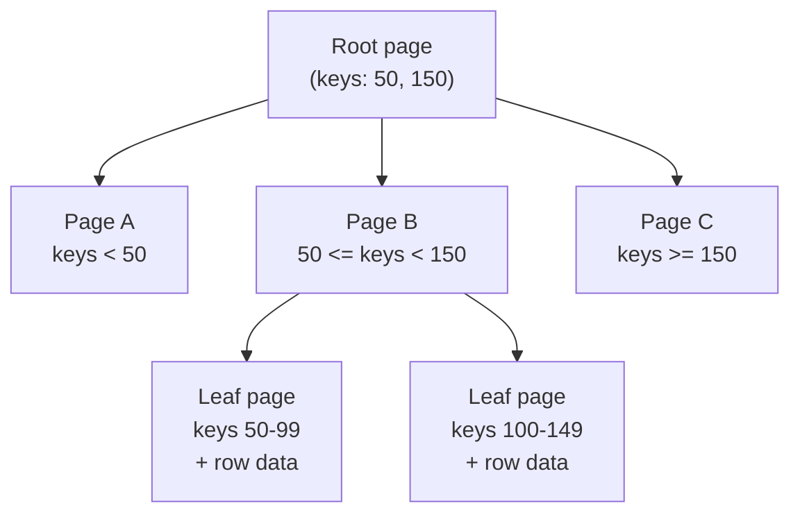
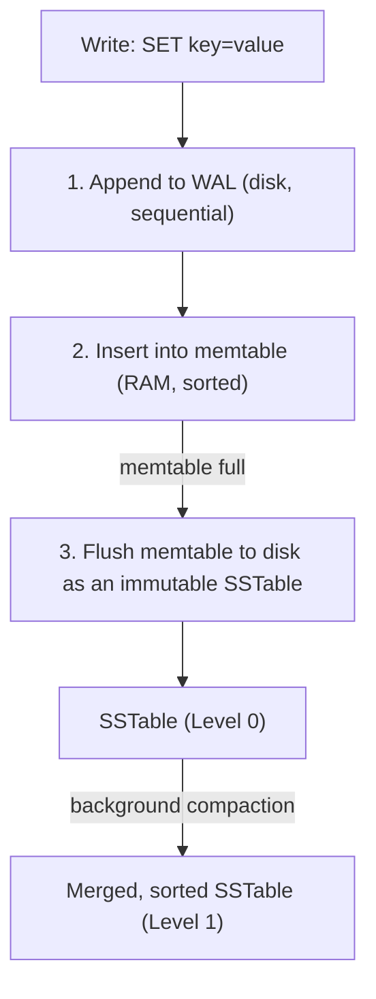
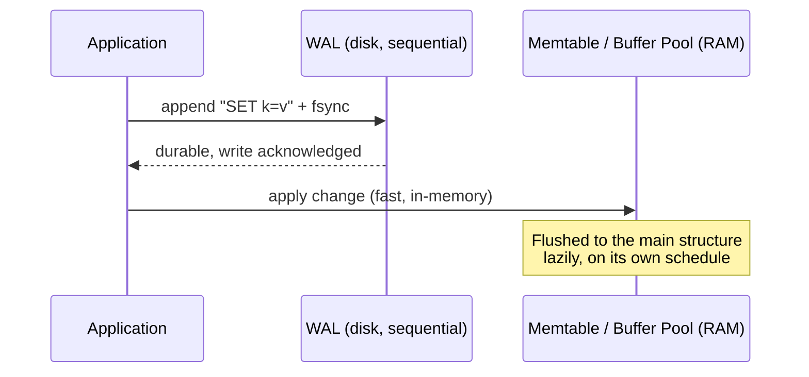
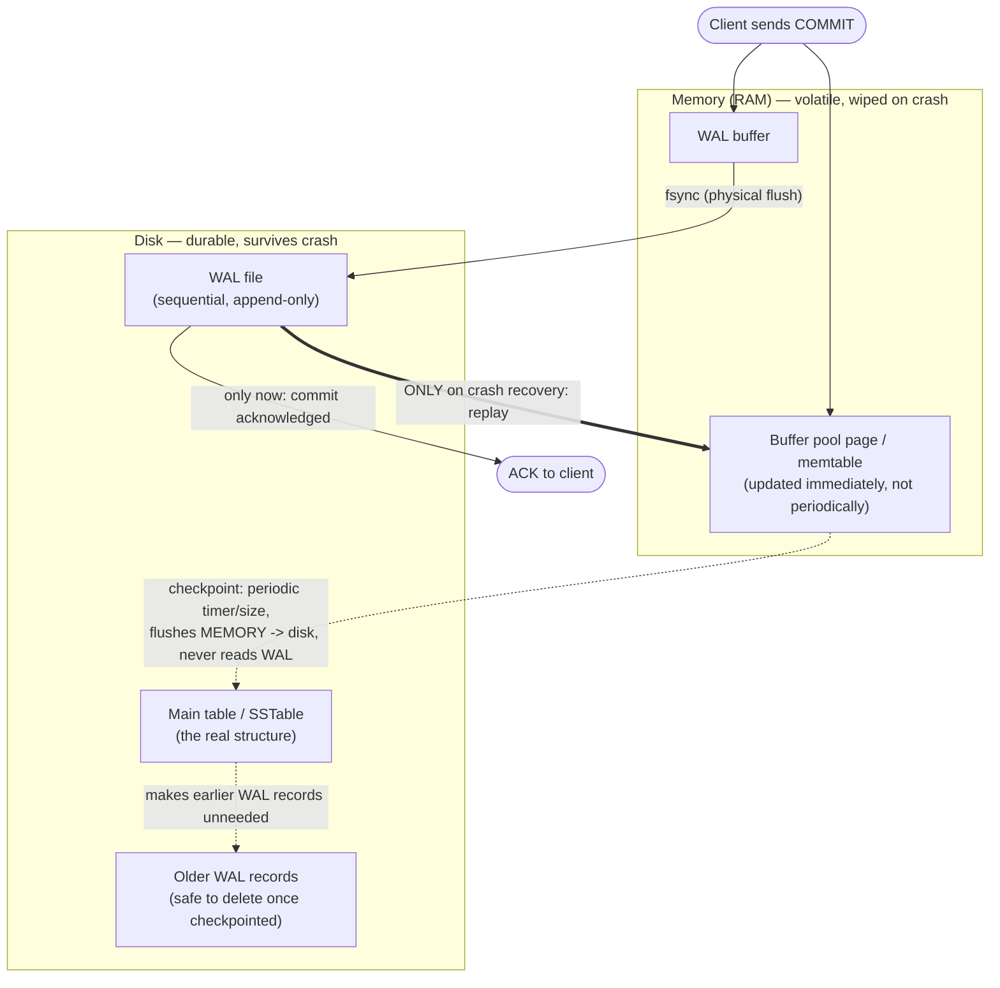

# Prerequisite Concepts, Part 10: The Physics of Persistence (B-Trees vs. LSM-Trees)

[Part 6](06_mechanical_sympathy_and_physics_of_latency.md) already made the core physical
argument — random disk access costs ~9 ms of pure mechanical waiting, sequential access
doesn't — and used it to sketch, in one paragraph, why Cassandra and RocksDB append writes
instead of updating in place. [Part 2](02_data_and_consistency.md) separately named
**B-tree indexes** as the default structure behind "how does a database find a row without
scanning everything." Neither part actually finished the argument: Part 6 never explains
what a B-tree's write path costs that an LSM-tree's doesn't, and Part 2 never explains what
happens on the *write* side of an index at all. **This part finishes both**, then adds the
two mechanisms every storage engine — B-tree or LSM-tree, relational or "NoSQL" — depends
on to survive a crash: **fsync** (the physical durability boundary) and the **write-ahead
log** (the trick that makes durability affordable). It closes by showing that "SQL vs.
NoSQL" is largely the wrong axis for this discussion — the real axis, the one that actually
determines performance, is B-tree vs. LSM-tree, and databases on both sides of the SQL
label pick from the same two structures.

## Recap: What Parts 2 and 6 Already Own, and What This Part Adds

| Question | Earlier part's answer | This part's answer |
|---|---|---|
| Why do databases use a separate structure instead of scanning every row? | [Part 2](02_data_and_consistency.md#indexing-why-databases-dont-scan-everything): "a B-tree index, O(log n)" | The actual page-based structure, its write path, and why that write path is expensive |
| Why do Cassandra/RocksDB append instead of updating in place? | [Part 6](06_mechanical_sympathy_and_physics_of_latency.md#cassandra-lsm-trees-turning-random-writes-into-sequential-ones): "an LSM-tree, sequential writes" | The full mechanism — memtable, WAL, SSTable, compaction — and what it costs on the *read* side in exchange |
| What guarantees does a committed transaction actually have? | [Part 2](02_data_and_consistency.md#acid-vs-base): "**D**urability — once committed, a write survives a crash" | The physical mechanism that makes that guarantee true: `fsync` and the write-ahead log |
| Is "NoSQL" one kind of database? | Not covered | No — it's a data-model label sitting on top of the same two storage-engine choices this doc covers, chosen independently |

## The Real Question Every Storage Engine Is Answering

Strip away the marketing on any database product and it's making one physical bet: **data
lives on a medium where random writes are expensive and sequential writes are cheap** (Part
6's ~9 ms seek-and-rotate tax, or flash's write-amplification tax), **so every persistent
data structure has to decide where to pay that cost** — on the write path, the read path,
or some blend of both. There is no structure that makes both free simultaneously; this is
the central, unavoidable trade-off the rest of this doc explores from both directions.

## B-Trees, Fully Unpacked: Optimizing for Reads by Paying on Writes

A **B-tree** (the structure behind Postgres and MySQL/InnoDB's default engine, SQLite,
MongoDB's default WiredTiger engine, and most traditional relational databases) is a
balanced, sorted, n-ary tree of fixed-size **pages** — typically 4-16 KB, deliberately sized
to match the OS's own page size so a "read one B-tree page" operation is exactly "read one
disk block," no partial reads or wasted extra I/O. This dominance is why it's informally
called **the ubiquitous B-tree** — not the only structure that could work, but the strong
default for the point-lookup/range-query, moderate-write shape almost every OLTP workload
has, for reasons the next two paragraphs make precise.

**The read path — a guided descent from root to leaf**: start at the root, compare the
target key against the page's sorted keys, follow the matching child pointer, repeat until
a leaf page holds the actual row (or a pointer to it). Call this a **guided descent**
because each step is *directed*, not exhaustive — one comparison against a node's sorted
keys picks exactly one of its many children to follow next, no scanning every branch, no
backtracking. A tree of **fanout** *b* (the number of children each node/page can hold)
holding *n* keys has depth **log_b(n)** — with a realistic fanout in the hundreds (many
small key/pointer pairs fit in one 4-16 KB page, which is why these are sometimes called
**fat nodes**: "fat" relative to a binary tree's thin 2-child node), a billion-row table is
typically only **3-4 levels deep**, so a lookup costs 3-4 page reads, not 3-4 seeks through
a huge structure — the fat node is precisely what's trading cheap in-memory comparisons for
far fewer expensive disk reads. This is genuinely fast, and — because rows live sorted in
place —
a **range query** (`WHERE created_at BETWEEN X AND Y`, exactly [Part 2's range-query
point](02_data_and_consistency.md#indexing-why-databases-dont-scan-everything)) is just
"find the start, then read the next several leaf pages in sequence," no extra work per row.

**The write path is where the cost Part 6 gestured at actually lives.** Updating a row means:

1. Find the leaf page holding that key (a read, same as above).
2. **Modify that page in place** — and because the row could be *any* key, the page it
   lives on could be anywhere on disk. This is, mechanically, exactly the random-access
   pattern [Part 6](06_mechanical_sympathy_and_physics_of_latency.md#random-vs-sequential-access-on-a-physical-disk)
   describes: an update to key 50 and an update to key 8 million touch two unrelated
   physical locations, each paying its own seek.
3. If the page is now full, it **splits** into two pages, and the split has to be recorded
   in the *parent* page too — occasionally cascading multiple levels up the tree. A single
   logical row insert can therefore turn into several page writes, not one.

**Why this is the "read-optimized" side of the trade-off, precisely stated**: a B-tree keeps
exactly one physical copy of each row, always up to date, always in one findable location —
which is *why* reads are so cheap (nothing to reconcile, nothing to search for across
multiple copies) — but that same property means every write has to find and mutate that one
location immediately, in place, wherever it happens to be. The read path's simplicity and
the write path's random-I/O cost are the same design decision, seen from two sides.

**A mitigation worth naming**: copy-on-write B-trees (e.g., LMDB) never modify a page in
place at all — a write copies the affected page and every ancestor up to a new root,
leaving the old tree fully intact and readable until the new root is atomically swapped in.
This trades some extra write volume (copying ancestor pages) for a genuinely different
durability story (the old tree is always a valid, complete snapshot — no WAL-based crash
recovery needed, a point the WAL section below returns to), but it does not remove the
random-write cost of the standard mutable B-tree this doc otherwise describes.

## LSM-Trees, Fully Unpacked: Optimizing for Writes by Paying on Reads

[Part 6 already gave the one-paragraph version](06_mechanical_sympathy_and_physics_of_latency.md#cassandra-lsm-trees-turning-random-writes-into-sequential-ones)
of the **Log-Structured Merge-tree** — the structure behind Cassandra, RocksDB, LevelDB,
HBase, and most write-heavy stores. Here is the full mechanism it referenced but didn't
walk through:

1. **Write-ahead log (WAL) first.** Before anything else, the write is appended to a
   sequential on-disk log — purely for crash recovery, covered in its own section below.
2. **Memtable.** The write is also applied to an in-memory sorted structure (commonly a
   skip list or balanced tree) — this is what makes the write instantly queryable and
   costs no disk I/O at all beyond the WAL append.
3. **Flush to an SSTable.** Once the memtable reaches a size threshold, it's written to
   disk as a **Sorted String Table (SSTable)** — an immutable file, written once,
   start-to-finish, sequentially. Immutable is the operative word: an SSTable is never
   edited again, only read, merged, or eventually deleted.
4. **Compaction.** A background process periodically merges multiple SSTables into fewer,
   larger ones — dropping overwritten and deleted (**tombstoned**) values in the process —
   using a sequential merge-sort-style read-and-rewrite, never random access.

**The insight [Part 6](06_mechanical_sympathy_and_physics_of_latency.md#cassandra-lsm-trees-turning-random-writes-into-sequential-ones)
already named, restated precisely**: the write is *logically* random (an arbitrary key) but
*physically* sequential (always appended at the tail of the WAL, then the tail of a new
SSTable) — the engine has fully decoupled "where this key logically sorts" from "where
this byte physically lands," and paid for that decoupling by giving up "one row, one
physical location" entirely. A single key's history can now be scattered across the
memtable and several SSTables simultaneously, which is exactly where this structure's cost
shows up.

### The Read Path: Where the LSM-Tree's Bill Comes Due

Reading key *K* means: check the memtable, then check each SSTable that might contain *K*
— newest first, since a later SSTable's value for the same key supersedes an older one —
until a match is found. Without help, that's a linear scan across every SSTable the engine
has ever flushed, which would make reads scale *worse* over time as more SSTables
accumulate. Two structures exist specifically to keep this bounded:

- **Bloom filters** — a compact, per-SSTable probabilistic structure that answers "is key
  *K* definitely absent from this file?" in O(1) with zero false negatives (it can say
  "maybe present" incorrectly, never "absent" incorrectly). Checking a bloom filter first
  lets the engine skip opening most SSTables entirely for a given lookup, at the cost of a
  small, fixed amount of extra memory per SSTable.
- **Sparse indexes** — since each SSTable is internally sorted, a small in-memory index of
  "every Nth key's byte offset" is enough to binary-search *within* a candidate file
  without scanning it linearly.
- **Compaction itself** is a read-cost mitigation, not just housekeeping: fewer, larger
  SSTables means fewer files a read has to consult in the first place. Mechanically, merging
  is a **k-way merge** (mergesort-style, since every SSTable is already internally sorted) —
  read all candidate files sequentially, emit one sorted output stream, dropping any key
  whose newer version or tombstone supersedes it — never random access. This is why
  compaction *strategy* is a first-class tuning knob — **size-tiered compaction** (merge
  same-size SSTables together once N of them accumulate; cheap to run, but lets more stale
  copies of a key accumulate before merging) versus **leveled compaction** (RocksDB's model:
  organize SSTables into levels L0, L1, L2… each roughly **10x larger** than the one above
  it, with bounded key-range overlap *within* a level; more compaction I/O up front, but a
  read checks far fewer files) is a direct write-cost-vs-read-cost dial, not an arbitrary
  implementation detail.

#### Bloom Filters, Precisely: The Probabilistic Math

**The structure**: a fixed-size bit array of **m** bits, all starting at 0, plus **k**
independent hash functions, each mapping any key to one of the m positions.

- **Insert** (once, when a key is written into an SSTable): compute all k hash values of
  the key, set each of those k bits to 1.
- **Query** ("might K be in this file?"): compute the same k hash values for K, and check
  whether *every one* of those k positions is currently 1.
  - **Any bit is 0** → K was **definitely never inserted** — if it had been, that exact bit
    would already be 1, and bits are never unset. Zero false negatives, guaranteed by
    construction, not by luck.
  - **All bits are 1** → "**maybe present**" — could be a real hit, or a **false positive**:
    those bits could all have been set to 1 by *other* keys' hashes colliding on the same
    positions, purely by chance.

**The false-positive rate is a formula, not a guess**: for n inserted keys, an m-bit array,
and k hash functions, the false-positive probability is approximately

> **p ≈ (1 − e^(−kn/m))^k**

minimized at **k ≈ (m/n) · ln(2)** hash functions for a given bits-per-key budget. In
practice, roughly **~10 bits per key** with the optimal k gives about a **1% false-positive
rate** — the literal knob RocksDB and Cassandra expose as "bloom filter bits per key": more
bits per key buys a lower false-positive rate (fewer wasted SSTable opens) at the cost of
more memory.

**Why the asymmetry is exactly right for this job**: a false positive costs one wasted file
open — the engine checks, finds nothing, moves on, correctness untouched. A false negative
would silently skip a file that actually held the key, corrupting the read. Only one
direction of error is tolerable here, so the structure is deliberately built to guarantee
that direction never happens, at the cost of accepting the other.

## Naming the Trade-off Precisely: Write, Read, and Space Amplification

"B-tree is read-optimized, LSM-tree is write-optimized" (Part 6's summary) is the right
one-liner, but the trade-off is actually three separate, nameable costs — worth knowing by
name because tuning any real engine (RocksDB's dozens of knobs, Cassandra's compaction
strategy setting) means explicitly trading these against each other:

| Amplification type | What it measures | B-tree | LSM-tree |
|---|---|---|---|
| **Write amplification** | Bytes actually written to disk, per logical byte written by the application | High — a small update can trigger a full page rewrite, plus cascading page splits | Lower for the initial write (sequential append), but compaction re-writes the same data multiple times over its lifetime |
| **Read amplification** | Number of disk reads needed to answer one logical read | Low — one page-read path per level, one physical copy of each row | Higher — may need to check the memtable plus several SSTables per read, mitigated but not eliminated by bloom filters |
| **Space amplification** | Disk space used, versus the logical size of the data | Low — one live copy per row, reclaimed immediately on overwrite | Higher — stale/overwritten versions and tombstones linger physically on disk until compaction runs and reclaims them |

This is a specific instance of the **RUM conjecture** (Read, Update, Memory) worth knowing
by name: a storage engine can optimize strongly for at most two of these three costs at
once — pushing one down mechanically pushes at least one other up. A B-tree optimizes
read + memory(space) at the cost of update; an LSM-tree optimizes update + (partially)
memory at the cost of read — there is no configuration of either structure that wins on all
three simultaneously, which is exactly why "just use whichever is faster" isn't a coherent
question until a workload is specified.

**Where the name comes from, precisely**: Athanassoulis, Kester, Maas, Stoica, Idreos,
Ailamaki & Callaghan, *"Designing Access Methods: The RUM Conjecture"* (EDBT 2016). Worth
being precise that it's a **conjecture**, not a proven theorem — no one has mathematically
proven a structure minimizing all three simultaneously is impossible; it's an empirical
pattern every known access method obeys, used as a design heuristic rather than an
impossibility proof. Bloom filters are this trade-off in miniature: they spend **Memory**
(the bit array) to reduce **Read** cost, without touching **Update** cost at all — the same
three-way trade the conjecture names for a whole storage engine, just scoped to one
structure inside it.

## Worked Example: The Same Workload, Two Engines

A time-series ingestion workload — a constant stream of new rows, keyed by a random device
ID, almost never updated after insert, occasionally range-queried by timestamp:

| | B-tree engine (e.g., Postgres) | LSM-tree engine (e.g., Cassandra) |
|---|---|---|
| Write cost | Each insert risks a random-access page write somewhere in the tree, per [Part 6's ~9 ms tax](06_mechanical_sympathy_and_physics_of_latency.md#random-vs-sequential-access-on-a-physical-disk) if the device-ID keyspace is effectively random | Every insert is a sequential WAL append + memtable insert — no seek, regardless of key randomness |
| Sustained write throughput | Degrades as the table grows past what fits in the page cache, since more inserts land on pages not already in RAM | Stays roughly flat — the hot path never depends on where in the keyspace a write lands |
| Read cost (single row) | One tree traversal, one physical location, cheap and consistent | Potentially memtable + N SSTables, mitigated by bloom filters — variance depends on compaction state |
| Range query (by timestamp) | Cheap if timestamp is the index — sorted, sequential leaf reads | Cheap **only if data is sorted/clustered by timestamp** — otherwise scattered across many SSTables |

**Why this workload is the textbook LSM-tree case**: high write volume, effectively random
keys, few updates — exactly the shape that makes a B-tree pay Part 6's random-write tax on
every single insert, while an LSM-tree's sequential-append write path never notices the
key's randomness at all. Flip the workload — a read-heavy dashboard querying a
slowly-changing reference table — and the trade favors the B-tree just as clearly, since its
read path is strictly simpler and its low update volume never triggers the LSM-tree's real
advantage.

## fsync: The Physical Line Between "Written" and "Durable"

Everything above assumed a write "reaches disk." That assumption is false by default, and
the gap between "the OS accepted this write" and "this write will survive a power loss" is
exactly what `fsync` exists to close.

**Why the gap exists at all**: a `write()` syscall, by default, only copies data into the
OS's **page cache** — RAM the kernel uses to batch and reorder disk I/O for performance,
per [Part 6's storage-tier economics](06_mechanical_sympathy_and_physics_of_latency.md#the-economics-of-machine-cost-is-physics)
(RAM is ~100x pricier than SSD specifically because it's faster, and the kernel exploits
that speed by buffering here rather than touching the slow medium on every call). `write()`
returning success means "the kernel has your bytes," not "the bytes are on the physical
platter or flash cell" — a power failure or kernel panic between those two moments loses
data the application already believes is safely stored.

**What `fsync(fd)` actually does**: it blocks until every buffered page for that file
descriptor is physically flushed out of the page cache and onto the storage device
(and, on some hardware, forces the device's own onboard write cache to flush too) — only
after `fsync` returns does "durability" in [Part 2's ACID
sense](02_data_and_consistency.md#acid-vs-base) become a true statement rather than an
optimistic assumption.

**Why this isn't free**: `fsync` forces exactly the kind of I/O [Part 6](06_mechanical_sympathy_and_physics_of_latency.md#random-vs-sequential-access-on-a-physical-disk)
warns is expensive — a physical flush, not a RAM-speed operation — and calling it on every
single write serializes an application against real device latency on every operation. This
single cost is why database engines don't call `fsync` naively per write, and is the direct
motivation for the mechanism in the next section.

## The Write-Ahead Log: Making Durability Affordable

A **write-ahead log (WAL)** — sometimes called a **commit log** (Cassandra's term for the
same mechanism) or **redo log** (MySQL/InnoDB's term) — is the single idea that makes both
B-tree and LSM-tree engines durable *without* forcing every write to pay for a full,
expensive, random-access flush of the main data structure before acknowledging success.

**The core idea**: before applying a change to the real (expensive-to-write-durably,
possibly-random-access) data structure, first append a compact description of that change
— "set key K to value V," or "row R changed from A to B" — to a **separate, append-only log
file**. An append-only file only ever grows at its tail, which means:

1. The WAL write itself is **sequential**, [Part 6's cheap access
   pattern](06_mechanical_sympathy_and_physics_of_latency.md#random-vs-sequential-access-on-a-physical-disk),
   regardless of how random the actual keyspace being modified is.
2. `fsync`-ing *just the WAL* is far cheaper than `fsync`-ing the main structure, because
   the WAL is one small, sequential, recently-written region — not scattered pages across
   a multi-gigabyte B-tree or a stack of SSTables.
3. The engine can acknowledge the write as durable **as soon as the WAL fsync completes**,
   and apply the change to the actual B-tree page or LSM memtable **lazily**, in memory,
   on its own schedule — the expensive structure gets updated whenever is convenient, since
   the WAL already guarantees the change survives a crash even if that update hasn't
   happened yet.

**Crash recovery — the payoff**: if the process or machine dies before the memtable/B-tree
page changes were ever flushed, the engine's recovery step on restart is simply: read the
WAL from the last known-durable point, and **replay** every logged change against the
in-memory structures. The WAL is, in effect, the single source of truth for "what actually
happened," with everything else (memtable, page cache, SSTables) treated as a
reconstructible cache of that log — which is exactly the property that lets a B-tree engine
skip an expensive in-place page flush on every write and an LSM-tree's memtable exist
entirely in volatile RAM in the first place, in both cases without sacrificing Part 2's
Durability guarantee.

**Group commit — the other lever on `fsync` cost**: rather than `fsync`-ing the WAL after
every single transaction, an engine can batch several transactions' WAL appends together
and issue one `fsync` for the whole batch — trading a small amount of added latency (waiting
a few milliseconds to see if more transactions arrive) for dramatically higher throughput,
since the expensive physical flush is now amortized across many transactions instead of
paid once per transaction. This is the same *cost-amortization-via-batching* pattern
[Part 8](08_cost_of_communication.md#paying-less-tax-data-locality-batching-coarse-apis-and-caching)
already established for network calls, applied here to the disk's durability boundary
instead.

**fsync frequency is a named, tunable setting, not a fixed property of "having a WAL" —
verified defaults, not assumed:**

| Engine | Setting | Default | What it actually does |
|---|---|---|---|
| MySQL/InnoDB | `innodb_flush_log_at_trx_commit` | `1` | fsync on every commit (the safe default); `0`/`2` fsync once per second instead, trading up to 1s of possible loss for speed |
| PostgreSQL | `synchronous_commit` | `on` | fsync on every commit; sets to `off` to have the WAL writer flush on a timer (`wal_writer_delay`, default `200ms`) instead |
| SQLite | `synchronous` pragma | `FULL` | fsync on every commit and before every checkpoint |

**The pattern across all three**: fsync frequency and the crash-loss window are the same
knob pointed in opposite directions — "every commit" means zero data-loss window at the
cost of speed; "every N milliseconds" means a data-loss window exactly as wide as N, in
exchange for not paying a physical flush on every single transaction.

## Checkpointing: Why the WAL Doesn't Grow Forever

Everything above explains why a WAL is cheap to *write*. It doesn't yet explain why the WAL
doesn't simply grow without bound forever — every engine described above has to answer
this too, and the answer is the same mechanism across all of them: **checkpointing**.

**The core idea**: periodically (on a timer, a size threshold, or both), the engine takes
whatever changes are sitting in memory but not yet reflected in the main structure — dirty
B-tree pages still only in the buffer pool, or a memtable not yet flushed to an SSTable —
and actually writes them into that main structure for real. Once that flush completes, every
WAL record *before* that point is no longer needed for crash recovery: replaying the log
would just reapply changes that are already safely reflected in the durable structure. Those
older WAL records can be safely deleted or their disk space recycled.

**A common point of confusion worth heading off directly**: checkpointing does not read from
the WAL to update the main structure. The change was already applied to the in-memory page/
memtable back at commit time (immediately, not periodically) — a checkpoint just flushes
that *already-current* in-memory state out to disk. The WAL is only ever read back and
replayed in one situation: crash recovery, to reconstruct in-memory changes that were
acknowledged as committed but never made it to a checkpoint before the crash. In normal,
no-crash operation, the WAL is written to and never read from again.

**Reading the diagram**: the solid path (`Client -> WAL buffer -> fsync -> WAL file -> ACK`)
is what makes every commit durable, and it never touches the main table at all. The dotted
path (`buffer pool / memtable -> checkpoint -> main table`) is a completely separate,
periodic process reading from *memory*, not from the WAL. The thick path
(`WAL file -> replay -> buffer pool / memtable`) only ever fires once, on restart after a
crash — it is the only arrow in this whole diagram that reads the WAL back.

**This is exactly what's already in this doc without being named as checkpointing**: etcd
cutting a new WAL segment past 64 MB (from the section below) and Postgres's own periodic
`CHECKPOINT` operation are both instances of this — old segments/records become eligible
for removal once nothing in them is needed for recovery anymore. Without this, the WAL would
be a permanently growing append-only file, which would eventually make crash recovery itself
slow (replaying years of history) and consume unbounded disk space — checkpointing is what
bounds both.

**This is also the formally named version of the whole WAL story**: the combination of
write-ahead logging, periodic checkpointing, and redo/undo recovery on restart is exactly
what **ARIES** (*Algorithms for Recovery and Isolation Exploiting Semantics* — C. Mohan et
al., IBM Almaden Research Center, 1992) formalizes as a single, complete algorithm. ARIES is
still the textbook reference for this — IBM Db2 and Microsoft SQL Server both implement it
directly, and most other engines' WAL+checkpoint designs are close variations on the same
idea rather than an independent invention.

**The WAL is orthogonal to B-tree vs. LSM-tree, not tied to either.** Postgres, MySQL/InnoDB,
and SQLite (all B-tree engines) all have a WAL/redo log. Cassandra, RocksDB, and LevelDB
(all LSM-tree engines) all have one too — in fact an LSM-tree's WAL is *structurally*
identical to its SSTables' write pattern (both are append-only sequential files), which is
part of why LSM-trees pair so naturally with cheap durability. The lesson: **durability
(WAL + fsync) and the choice of primary data structure (B-tree vs. LSM-tree) are two
independent design decisions** — every serious storage engine needs an answer to both,
and neither answer implies the other. It goes further than storage engines, too — the next
section covers systems that use the exact same mechanism to protect something that isn't
row/key data at all.

### WAL Beyond Storage Engines: Protecting a Consensus Log, Not a Data Structure

Every example so far uses a WAL to make a *data structure* (a B-tree's pages, an LSM-tree's
memtable) durable. Distributed coordination systems apply the identical mechanism to a
different target entirely: **the replicated consensus log itself**, which is the actual
source of truth in a Raft- or ZAB-based system, not a cache of one.

- **etcd** (the coordination store behind Kubernetes) has a Go package literally named
  `wal` — verified directly from etcd's own package docs: it appends Raft log entries and
  periodic snapshots to segmented, sequential on-disk files, cutting a new segment past
  64 MB. Etcd's own docs state the payoff explicitly: **the entire Raft state of a member
  can be recovered from the WAL alone** — the same "log is the source of truth, everything
  else is a reconstructible cache of it" property this doc already established for
  B-trees/LSM-trees, just applied to consensus state instead of row data.
- **Apache ZooKeeper** does the same thing under a different name that turns out to be the
  same word: verified directly from ZooKeeper's own admin guide, its transaction log class
  is called `FileTxnLog`, and ZooKeeper's own documentation parenthesizes it explicitly as
  the **"Transactional Log (WAL)"** — fsynced before any update is acknowledged, with
  periodic snapshots plus log replay reconstructing full state on recovery, mechanically
  identical to the checkpoint-plus-WAL-replay pattern Postgres uses.

**Why this matters beyond "yet another example":** it's confirmation that WAL isn't a
database trick at all — it's the general answer to *any* system's version of the same
physical problem this doc opened with (cheap sequential durability for something that must
survive a crash), whether the thing being protected is a B-tree page, an LSM-tree memtable,
or a consensus algorithm's own log of agreed-upon operations.

**The broadest version of this point already has a name.** Jay Kreps' 2013 essay *"The Log:
What every software engineer should know about real-time data's unifying abstraction"*
(LinkedIn Engineering — the essay that laid the conceptual groundwork for Kafka, later
expanded into the O'Reilly book *I ♥ Logs*) makes exactly this argument at the level of a
whole system, not just one storage engine: an append-only log can be *the* source of truth
that every other view of the data (a database's tables, a cache, a search index, another
service's local copy) is just a derived, reconstructible projection of. A database's WAL,
etcd's `wal`, and ZooKeeper's `FileTxnLog` are all small, single-node instances of the same
idea Kafka builds an entire distributed system's data-integration story around.

## NoSQL: A Data-Model Label, Not a Storage-Engine Choice

[Part 2's ACID-vs-BASE section](02_data_and_consistency.md#acid-vs-base) already covers the
consistency-model half of "SQL vs. NoSQL." The half that section doesn't cover — and the
one this doc is actually positioned to answer — is: **what's physically storing the bytes
underneath either label?** The honest answer is that "NoSQL" describes a *data model*
(key-value, document, wide-column, graph) and often a *consistency* choice, but says nothing
guaranteed about the storage engine underneath, which is a B-tree or an LSM-tree exactly as
described above, chosen independently of the data-model label:

| Database | Marketed as | Actual default storage engine |
|---|---|---|
| PostgreSQL, MySQL/InnoDB, SQLite | SQL / relational | B-tree |
| MongoDB (WiredTiger engine) | NoSQL / document store | B-tree, by default (can be configured for a log-structured mode) |
| Cassandra, HBase | NoSQL / wide-column store | LSM-tree |
| RocksDB, LevelDB | NoSQL / embedded key-value store | LSM-tree |
| MySQL with the MyRocks engine | SQL / relational (same query language) | LSM-tree |

**The MyRocks row is the whole argument in one line**: it is MySQL — the same SQL syntax,
the same relational data model everyone associates with "SQL databases" — running on
RocksDB's LSM-tree underneath, chosen specifically by teams whose write volume makes
InnoDB's B-tree write amplification the actual bottleneck. The data model a query language
exposes and the physical structure storing the bytes are **separable design decisions**;
"NoSQL" became shorthand for "probably LSM-tree, probably eventual consistency" through
historical correlation (Cassandra, DynamoDB, and HBase popularized the label and all
happened to pick LSM-trees for exactly the write-throughput reasons this doc covers), not
because the term names a storage mechanism at all. **The question worth asking about any
data store is never "is it SQL or NoSQL" — it's "what's my read/write ratio and key
distribution, and which of B-tree or LSM-tree actually fits that shape,"** which is a
question Part 2's CAP/consistency axis and this doc's storage-engine axis both feed into
independently, not a question either axis answers alone.

## Real-World Usage: Which Systems Choose What, and Why

The table in the previous section showed *that* the storage engine and the SQL/NoSQL label
are separable; this section widens the lens to the full landscape of production systems,
organized by **workload archetype** rather than by marketing category — because workload
archetype, not label, is what actually predicts which structure a system picked and why.

| Workload archetype | Systems that use it | Storage engine | Why this fits |
|---|---|---|---|
| **OLTP / transactional** (banking, e-commerce, ERP — many small reads, point updates, strong consistency) | PostgreSQL, MySQL/InnoDB, Oracle, SQL Server | B-tree | Read-heavy-relative-to-write, point lookups and range scans on indexed columns are the dominant access pattern — exactly the B-tree's strength, and the cost of in-place updates is acceptable at this scale |
| **Embedded / mobile local storage** (an app's own on-device data, no server round-trip) | SQLite, Realm | B-tree | Single-writer, modest write volume, and the read path's simplicity matters more than write throughput on a phone's flash storage |
| **Wide-column / high-write telemetry** (chat/message storage, IoT sensor data, activity feeds) | Cassandra, ScyllaDB (Discord's message-storage migration from Cassandra is a publicly documented case) | LSM-tree | Extremely high write volume, near-random keys (message ID, device ID), few updates after insert — the textbook LSM-tree shape from the worked example above |
| **Big-data / Hadoop-ecosystem wide-column store** | HBase, Google Bigtable (the paper that coined the terms *SSTable* and *memtable* used throughout this doc) | LSM-tree | Same write-throughput logic as Cassandra, at a scale (petabytes, thousands of nodes) where B-tree write amplification would be prohibitive |
| **Managed cloud key-value at massive scale** | Amazon DynamoDB | Log-structured / LSM-family internals (per AWS's public architecture discussions) | Same throughput-over-strict-per-row-cost trade-off, packaged as a managed service rather than self-operated |
| **Embedded engine inside other distributed systems** | RocksDB (Facebook's LevelDB fork) inside MySQL as **MyRocks**, inside TiKV (PingCAP's distributed KV store), as Kafka Streams' and Flink's local state-store backend; **Pebble** (CockroachDB's own Go-native LSM engine, built to replace RocksDB) inside CockroachDB; a RocksDB fork (**DocDB**) inside YugabyteDB | LSM-tree | Once a team needs an embeddable, crash-safe, high-write KV engine as a *component* rather than a standalone database, LSM-tree implementations dominate — this is the same engine choice as the row above, just reused as a building block instead of exposed directly |
| **Distributed SQL / NewSQL** (SQL semantics at horizontally-scaled write volume) | CockroachDB (SQL over Pebble), YugabyteDB (SQL over DocDB) | LSM-tree, with a relational query layer on top | The MyRocks argument generalized: a SQL front end is a data-model/query-language choice, entirely separable from the storage engine underneath, and these systems pick LSM specifically because horizontal write scale is the design goal |
| **Browser/local application storage** | Chrome's IndexedDB (LevelDB-backed), Bitcoin Core's UTXO/chainstate database (LevelDB) | LSM-tree | Even single-machine, non-networked software picks an LSM-tree when its workload is write-heavy with little need for complex range queries — the choice is about access pattern, not distributed scale |
| **Full-text search** | Elasticsearch / Apache Lucene | Not literally a B-tree or LSM-tree, but the *same underlying idea*: immutable, sorted segments written once, merged in the background — Lucene's "segment merge" is functionally compaction under a different name | Worth knowing because it shows the append-then-merge principle this doc covers generalizes beyond classic KV/relational storage into search indexing entirely |

**The instructive exception — TimescaleDB.** Time-series data (the worked example's
canonical LSM-tree shape) is exactly the workload archetype that should favor an LSM-tree.
TimescaleDB is a PostgreSQL extension — **B-tree underneath, by inheritance from Postgres**
— and is nonetheless a legitimate, widely-used choice for time-series workloads. The reason
isn't a mechanical exception to anything in this doc; it's that the team chose to trade
some write-path efficiency for full SQL compatibility, Postgres's mature tooling/ecosystem,
and operational familiarity — a deliberate, named trade against pure throughput, not proof
that the read/write analysis above doesn't apply. **This is the real lesson of the whole
real-world survey**: the mapping from workload to engine is a strong default, not a law —
a team can and sometimes should pick "the wrong one" for the workload shape in exchange for
something the mechanical analysis doesn't capture (ecosystem maturity, staffing familiarity,
existing tooling), as long as that trade is made consciously rather than by accident.

**Scope note — a third camp this doc doesn't cover.** Columnar/OLAP formats and warehouses
(Parquet, ClickHouse, Snowflake, BigQuery) are neither B-trees nor LSM-trees — they organize
data by *column* rather than by *row*, optimized for scanning millions of rows of a handful
of columns at once (an aggregation query) rather than finding or updating one row precisely.
That's a genuinely different problem (analytical scans vs. point lookups/range queries) with
its own first-principles treatment; naming it here only so the B-tree/LSM-tree framework
isn't mistakenly stretched to cover every storage engine that exists.

## Designing and Operating From First Principles

1. Is my workload write-heavy with a wide or random keyspace (favors an LSM-tree), or
   read-heavy with infrequent updates (favors a B-tree) — have I actually characterized
   this, or picked a database by its marketing label?
2. If I'm using an LSM-tree engine, have I chosen a compaction strategy (size-tiered vs.
   leveled) deliberately, based on whether write throughput or read latency matters more
   for this specific table — or left it at a default that may not fit my read/write ratio?
3. Do I know whether my database's `fsync` behavior is actually durable-by-default, or
   whether a setting (e.g., a database's "async commit" mode, or a filesystem mount option)
   is trading durability for throughput without my having made that trade-off consciously?
4. Am I calling `fsync` (or the equivalent commit setting) once per transaction naively, or
   does my engine batch commits (group commit) to amortize that physical flush cost?
5. If my process crashed right now, do I know — concretely, not just "the database handles
   it" — what my engine's WAL replay actually reconstructs, and how long that recovery
   would take on a large log?
6. Am I choosing "SQL" or "NoSQL" based on the data model and consistency needs I actually
   have, or am I implicitly assuming a storage-engine performance profile that the label
   doesn't actually guarantee (e.g., assuming a "NoSQL" choice is fast for writes without
   checking whether its engine is actually a B-tree)?
7. For a range-scan-heavy workload on an LSM-tree store, have I checked whether my data is
   physically clustered/sorted by the scan key, or am I scattering a logically sequential
   query across many unrelated SSTables?
8. Have I named which of the three RUM-conjecture costs (read, write/update, space
   amplification) I'm deliberately accepting for this specific table, rather than assuming
   a single engine choice optimizes all three?
9. If I'm picking a system whose workload archetype has a strong real-world default (e.g.
   time-series usually favors LSM-tree stores like Cassandra), and I'm leaning the other
   way, can I name the specific thing I'm trading for (ecosystem, tooling, team
   familiarity) — or am I just defaulting to what I already know?

## Key Takeaways

- Every persistent data structure is answering the same physical question — where to pay
  the cost of [Part 6's random-vs-sequential access
  gap](06_mechanical_sympathy_and_physics_of_latency.md#random-vs-sequential-access-on-a-physical-disk)
  — and no structure pays it nowhere.
- A B-tree keeps one physical, always-current copy of each row, sorted, which is exactly
  why reads and range-scans are cheap and why in-place updates cost a random-access page
  write (and possible cascading page splits).
- An LSM-tree defers all writes to a sequential WAL append and an in-memory memtable,
  flushing to immutable, sorted SSTables later — decoupling logical key order from
  physical write location, at the cost of a read potentially having to check multiple
  files, mitigated (not eliminated) by bloom filters and compaction.
- Write, read, and space amplification are three separate, nameable costs (the RUM
  conjecture) — a storage engine can optimize strongly for at most two at once; tuning a
  real engine (compaction strategy, index type) is choosing which two.
- `write()` returning success only means the OS page cache has the bytes — `fsync` is the
  actual physical durability boundary, and it's expensive precisely because it forces the
  random/physical I/O Part 6 already established is costly.
- The write-ahead log is what makes durability affordable: a cheap sequential append (and a
  cheap `fsync` on a small recent file) stands in for an expensive flush of the whole data
  structure, with crash recovery defined as "replay the log."
- Group commit batches multiple transactions' WAL fsyncs into one physical flush — the same
  cost-amortization-via-batching idea [Part 8](08_cost_of_communication.md) applies to
  network calls, applied here to disk durability.
- The WAL doesn't grow forever: checkpointing flushes pending in-memory changes into the
  main structure for real, after which older WAL records are no longer needed for recovery
  and get deleted/recycled — WAL + checkpointing + redo/undo recovery together is exactly
  what the ARIES algorithm (Mohan et al., IBM, 1992) formalizes.
- The WAL/durability mechanism and the B-tree-vs-LSM-tree choice are independent design
  axes — nearly every serious engine on either side needs both a log and a primary
  structure.
- WAL isn't storage-engine-specific at all: etcd's `wal` package and ZooKeeper's
  `FileTxnLog` (its own docs call it "Transactional Log (WAL)") apply the identical
  sequential-append-plus-fsync-plus-replay mechanism to a consensus log instead of a data
  structure — the entire Raft/ZAB state is recoverable from that log alone.
- "NoSQL" names a data model and often a consistency posture (per [Part
  2](02_data_and_consistency.md#acid-vs-base)), not a storage engine — MySQL can run on an
  LSM-tree (MyRocks) and MongoDB defaults to a B-tree (WiredTiger), proving the storage
  engine is a separable decision from the SQL/NoSQL label.
- The only question that actually predicts performance is read/write ratio and key
  distribution against B-tree vs. LSM-tree — not which marketing category a database falls
  into.
- Real-world usage clusters by workload archetype, not by label: OLTP and embedded/mobile
  storage lean B-tree (Postgres, MySQL/InnoDB, SQLite); high-write telemetry, wide-column,
  and embedded-engine-inside-another-system use cases lean LSM-tree (Cassandra, HBase,
  Bigtable, RocksDB/Pebble/DocDB inside MyRocks, TiKV, CockroachDB, YugabyteDB, Kafka
  Streams, Flink).
- Exceptions like TimescaleDB (B-tree, via Postgres, for a time-series workload that would
  otherwise favor LSM-tree) prove the mapping is a strong default, not a law — a
  consciously named trade (ecosystem, tooling) against pure throughput is a legitimate
  reason to pick "the wrong one" for the workload shape.
- Columnar/OLAP warehouses (Parquet, ClickHouse, Snowflake, BigQuery) are a third storage
  camp entirely — organized by column for analytical scans, not by row for point
  lookups — and aren't a B-tree/LSM-tree choice at all.

## Quick Self-Check

- Why does a B-tree's write path cost a random-access disk operation even though the tree
  itself is a well-organized, sorted structure?
- Why does a B-tree stay only 3-4 levels deep at a billion rows while a binary search tree
  over the same data would need ~30 — what specific structural choice (node size vs. child
  count) produces that difference, and what does "guided descent" mean as a description of
  the traversal itself?
- What does an LSM-tree give up on the read path in exchange for turning every write into a
  sequential append — and what two structures exist specifically to limit that cost?
- Name the three amplification costs in the RUM conjecture, and explain why no engine
  minimizes all three simultaneously.
- Why does `write()` returning successfully not guarantee durability, and what does `fsync`
  specifically do that closes that gap?
- Why is a WAL append cheap to make durable while a direct update to a B-tree page or an
  LSM memtable's eventual flush is not — what specific property of an append-only file
  makes the difference?
- What does "replay the WAL" actually reconstruct after a crash, and why does that mean the
  WAL — not the B-tree or the memtable — is the true source of record?
- If the WAL is append-only and never edited, what actually stops it from growing forever,
  and what has to happen before an old WAL record can be safely deleted?
- Why does MySQL running on RocksDB (MyRocks) prove that "SQL vs. NoSQL" and "B-tree vs.
  LSM-tree" are different, independent axes rather than the same choice under two names?
- Why does TimescaleDB choosing a B-tree (via Postgres) for a time-series workload not
  contradict the write-heavy-favors-LSM-tree argument made earlier in this doc?
- Name three real systems where an LSM-tree engine (RocksDB, Pebble, or a fork of one) is
  embedded *inside* another system rather than exposed as a standalone database — what do
  all three have in common that made an LSM-tree the right embeddable component?
- etcd and ZooKeeper both use a WAL, but not to protect a B-tree page or an LSM memtable —
  what are they actually using it to protect instead, and why does "replay the log"
  reconstruct that just as completely as it reconstructs a database's row data?

## Articulate It: Interview Framing & Vocabulary

### Three Ways to Explain This

- **Cost-relocation framing (the default for a B-tree vs. LSM-tree question):** "I'd frame
  this as a single physical cost — a random write on a real disk — that every storage
  engine has to pay somewhere. A B-tree pays it immediately, on every write, by mutating a
  page in place wherever it happens to live. An LSM-tree defers it entirely by always
  appending, and pays instead on the read side, checking multiple files instead of one. It's
  the same tax, just relocated to a different part of the request path."
- **Durability-boundary framing (good for a 'what happens if the power dies' or crash-safety
  question):** "I'd separate 'the OS accepted this write' from 'this write is durable' — the
  first is just a page-cache copy, the second only becomes true once `fsync` physically
  flushes it. The reason every serious engine has a write-ahead log is that fsyncing a
  small, sequential log is cheap, while fsyncing the real data structure on every write
  would be brutally expensive — the log is what lets you get a durability guarantee without
  paying full price for it on every single write."
- **Axis-separation framing (good for a 'should we use a NoSQL database' question):** "I'd
  push back gently on 'NoSQL' as the deciding factor — it describes a data model and often
  a consistency posture, not a storage engine. MySQL can run on RocksDB's LSM-tree and
  MongoDB defaults to a B-tree, so the real question I'd actually ask is what our read/write
  ratio and key distribution look like, and pick a storage engine — B-tree or LSM-tree —
  based on that, independent of whatever the marketing label says."
- **Real-world-pattern framing (good for demonstrating you're not just reciting theory):**
  "I'd point at what's already shipped in production: Cassandra, HBase, and Bigtable pick
  LSM-trees for the same reason — near-random keys at huge write volume — and that's also
  why RocksDB and its forks (Pebble, DocDB) end up embedded *inside* MyRocks, TiKV,
  CockroachDB, and YugabyteDB as a component rather than a standalone database. TimescaleDB
  is the instructive exception — B-tree, via Postgres, for a workload that would otherwise
  favor LSM — and it's a legitimate choice precisely because the team named what they were
  trading (SQL compatibility, ecosystem) against pure write throughput."

### Vocabulary Builder

**Technical shorthand — use these instead of over-explaining the concept every time:**

- **the ubiquitous B-tree** (n. phrase, informal) — the industry-wide default label for
  B-trees as the on-disk index structure of choice (Postgres, MySQL/InnoDB, SQLite,
  MongoDB's WiredTiger, most filesystem metadata) — "ubiquitous" because it's the strong
  default for the point-lookup/range-query, moderate-write workload shape, not because
  nothing else exists.
- **fanout** (n.) — the number of children a single B-tree node/page can hold; realistically
  in the hundreds, since a fixed-size disk page (4-16 KB) fits hundreds of small
  key/pointer pairs — the reason a B-tree stays only 3-4 levels deep even at billion-row
  scale.
- **fat node** (n. phrase, informal) — a B-tree node sized to fill one full disk page and
  packed with hundreds of keys and child pointers, in contrast to a binary tree's "thin"
  2-child node — the structural choice trading cheap in-memory comparisons for far fewer
  expensive disk reads.
- **guided descent** (n. phrase) — the B-tree search algorithm itself: at each node,
  comparing the target key against that node's sorted keys picks exactly one child to
  descend into next, repeated root to leaf — directed by comparison at every level, never a
  scan or backtrack.
- **memtable** (n.) — an LSM-tree's in-memory, sorted buffer for recent writes, flushed to
  disk as an SSTable once full.
- **SSTable (Sorted String Table)** (n. phrase) — an immutable, sorted, on-disk file an
  LSM-tree writes once and only ever reads, merges, or deletes — never edits in place.
- **compaction** (n.) — the background process that k-way-merges multiple sorted SSTables
  into fewer, larger ones, reclaiming space from overwritten/deleted keys and bounding read
  amplification; **size-tiered** vs. **leveled** (L0-L6, ~10x growth per level) are the two
  named strategies, [detailed above](#the-read-path-where-the-lsm-trees-bill-comes-due).
- **bloom filter** (n. phrase) — [the probabilistic math is worked out
  above](#bloom-filters-precisely-the-probabilistic-math): a bit array plus k hash
  functions, `p ≈ (1 − e^(−kn/m))^k` false-positive rate, zero false negatives by
  construction — answering "definitely absent, or maybe present" for a key in a given
  SSTable, letting reads skip files that can't possibly contain the target key.
- **RUM conjecture** (n. phrase, proper) — Athanassoulis et al., EDBT 2016; a storage engine
  can optimize strongly for at most two of Read, Update, and Memory(space) cost at once —
  an empirical design heuristic, not a proven impossibility theorem.
- **write/read/space amplification** (n. phrases) — the three costs the RUM conjecture
  names; a storage engine trades between them rather than minimizing all three at once.
- **write-ahead log (WAL)** (n. phrase) — an append-only log of intended changes, written
  and fsynced before (or instead of) the expensive main structure, replayed on crash
  recovery; also called a commit log (Cassandra) or redo log (InnoDB).
- **group commit** (n. phrase) — batching multiple transactions' WAL fsyncs into a single
  physical flush to amortize `fsync`'s cost across more work.
- **checkpoint** (n.) — the periodic operation that flushes in-memory changes into the main
  structure for real, after which older WAL records covering those changes are no longer
  needed for recovery and can be deleted/recycled — the mechanism that keeps the WAL bounded
  instead of growing forever.
- **ARIES** (n., proper) — *Algorithms for Recovery and Isolation Exploiting Semantics*
  (Mohan et al., IBM, 1992) — the formal academic algorithm combining WAL, checkpointing,
  and redo/undo recovery into one coherent method; still the textbook reference (Db2, SQL
  Server both implement it directly).
- **page cache** (n. phrase) — the OS's in-RAM buffer for disk I/O; a `write()` call lands
  here first, which is exactly the gap `fsync` exists to close.
- **workload archetype** (n. phrase) — a named shape of access pattern (OLTP, high-write
  telemetry, embedded/mobile) used to predict which storage engine a real system picked,
  instead of reasoning from its marketing label.
- **embedded storage engine** (n. phrase) — a KV engine (RocksDB, Pebble) used as an
  internal component inside a larger system (MyRocks, TiKV, CockroachDB) rather than
  exposed directly as a standalone database.

**Expressive phrases — for stating a trade-off fluently instead of listing pros/cons:**

- **"…the same tax, just relocated"** — a compact way to describe B-tree-vs-LSM-tree (or
  any similar architectural choice) as moving a fixed cost to a different part of the
  system, rather than eliminating it.
- **"…a hint that it's in RAM, not proof it's durable"** — a fluent way to describe what a
  successful `write()` call actually promises before `fsync`.
- **"…the log is the source of truth; everything else is a reconstructible cache of it"** —
  a precise way to explain what WAL-based crash recovery actually means mechanically.
- **"…a data-model label, not a storage-engine guarantee"** — a reusable way to push back on
  treating "NoSQL" as if it implies a specific performance profile.
- **"…a strong default, not a law"** — a fluent way to acknowledge a real-world pattern
  (workload archetype → engine choice) holds most of the time while still leaving room for
  a consciously named exception.

---

**Previous:** [Part 9: The Anatomy of a Request (DNS, BGP, and the Edge)](09_dns_bgp_and_the_edge.md)  |  **Next:** [Part 11: Taxonomy of Storage — Choosing by First Principles, Not Fashion](11_taxonomy_of_storage_choice.md)
