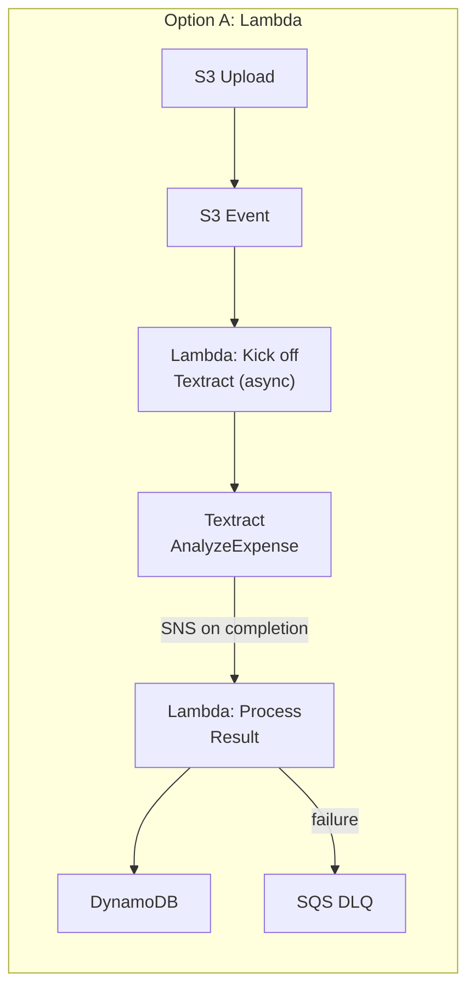
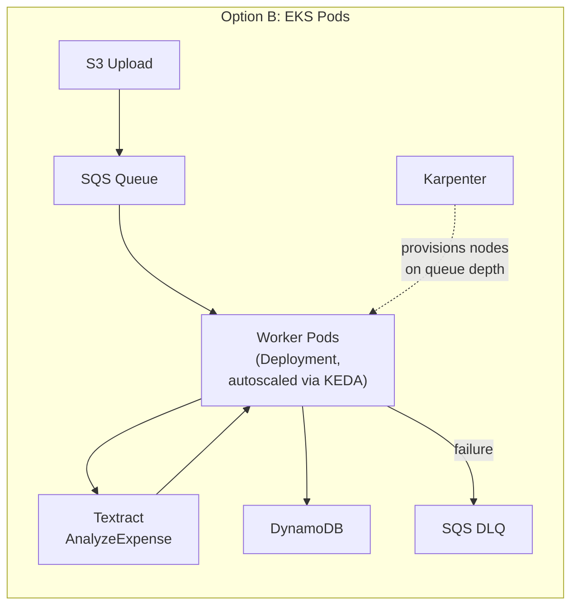

# Deep-Dive: Serverless (Lambda) vs. EKS Pods for Large-Scale Receipt Processing

A practical companion to the [Ingestion Pipeline tutorial](02_ingestion_pipeline.md) — that tutorial
covers the general Step Functions/Lambda/S3/Databricks shape; this walks through one
concrete, high-stakes decision inside it: **do you run the actual per-receipt processing
step on Lambda, or on pods in EKS?** This is a recurring real interview question ("serverless
vs. containers, and why") and most candidates answer it with vibes ("Lambda is simpler,
containers are cheaper at scale") instead of the actual cost model and latency mechanics
behind that intuition. This doc is the model.

## The Workload Shape That Actually Decides This

Before comparing platforms, pin down what "processing a receipt" actually involves — the
answer changes the whole analysis:

- **Ingest**: a receipt image/PDF lands in S3 (upload, scan, or forwarded email
  attachment).
- **Extract**: OCR/document understanding — for receipts specifically, **AWS Textract's
  `AnalyzeExpense` API** is purpose-built for this (vendor, line items, totals, tax, dates),
  which matters a lot for this analysis: **most of the "processing" is an API call to a
  managed AWS service, not CPU-bound work happening inside your own compute.** That makes
  this workload **I/O-bound, not CPU-bound**, which is the single biggest thing that changes
  the Lambda-vs-EKS math versus a workload that's actually crunching pixels itself (e.g. a
  custom vision model).
- **Validate & normalize**: business-rule validation, currency/date normalization, fraud/
  duplicate checks — lightweight CPU work.
- **Persist**: write structured results (DynamoDB/RDS) and the source file's final location
  (S3).
- **Traffic shape**: receipt processing is almost always **bursty**, not steady — expense
  apps see end-of-month/end-of-quarter spikes, retail-adjacent products see spikes around
  paydays and holidays. This burstiness is the second biggest lever on the decision, and
  it's worth clarifying explicitly before answering "which platform" in an interview, the
  same way the [ingestion tutorial](02_ingestion_pipeline.md#batch-vs-streaming-and-why-its-rarely-a-clean-binary)
  says to clarify latency requirements before assuming streaming.

## Two Architectures

The structural difference worth naming: in Option A, AWS manages the "how many workers are
running right now" decision entirely; in Option B, you manage it (via KEDA scaling pods on
queue depth, Karpenter scaling nodes under those pods) — more control, more to operate.

## Cost Model: The Actual Numbers

**Assumptions used below** (state these explicitly in an interview — the framework matters
more than the exact figures, and real AWS pricing varies by region/date, so treat these as
illustrative order-of-magnitude, not a quote):

- 2 seconds of billed compute per receipt, 2GB memory footprint (headroom for image
  handling + SDK overhead around the Textract call)
- us-east-1, on-demand Lambda pricing: **$0.20 per 1M requests + $0.0000166667 per GB-second**
- Fargate: **$0.04048 per vCPU-hour + $0.004445 per GB-hour**; pods sized 1 vCPU / 2GB
- EC2 Spot + Karpenter: roughly **45-55% of Fargate's effective rate** for equivalent
  capacity (no per-pod management markup, plus the Spot discount) — using ~50% here
- EKS control plane: **$0.10/hour ≈ $73/month**, fixed regardless of workload

| Volume | Lambda | Fargate (60% utilization) | EC2 Spot + Karpenter (60% utilization) |
|---|---|---|---|
| 1M receipts/month | **~$67** (near-zero fixed cost) | ~$133-163 (control plane + minimum warm nodes dominates) | ~$133-163 (same fixed-cost floor) |
| 50M receipts/month | ~$3,343 | ~$2,285 | ~$1,101 |
| 500M receipts/month | ~$33,433 | ~$22,857 | ~$10,358 |

**The crossover is real and it's about utilization, not raw compute price.** At low/spiky
volume, Lambda wins because it has **zero fixed cost** — an idle Lambda function costs
nothing, while an idle EKS cluster still bills for its control plane and whatever baseline
node capacity you keep warm to avoid cold-pod latency. At high, *sustained* volume, EKS
(especially self-managed EC2 with Spot + Karpenter) wins because Lambda's per-GB-second
price has **no volume discount** — it scales perfectly linearly forever — while EKS's
effective $/receipt keeps falling as utilization rises and Spot pricing stacks on top.

**The number that actually matters more than either column: utilization.** The 60%
utilization assumption above is doing a lot of work — a bursty receipt-processing workload
that's genuinely running hot only 30% of the time makes EKS's economics meaningfully worse
(you're paying for idle capacity the rest of the time), which is exactly why traffic shape
was called out as the second big lever above, not a footnote.

## Speed: Cold Starts vs. Burst-Absorption vs. Steady-State Tail Latency

This is where "which is faster" needs to be split into three different questions, because
Lambda and EKS trade places depending on which one you're asking:

- **Single-request cold start**: a cold Lambda invocation (new execution environment) adds
  roughly 100ms-2s depending on runtime and package size — mitigated with **Provisioned
  Concurrency** (keeps N execution environments warm, at extra cost) or, for Java
  specifically, **SnapStart** (near-eliminates it via snapshotting). An EKS pod that's
  already running and pulling off the SQS queue has **no equivalent cold start** — this is
  a genuine EKS advantage for steady-state tail latency once warm.
- **Burst-absorption (the more important question for this workload)**: when a spike of
  100K receipts lands in a minute, how fast can each platform add capacity? Lambda's
  default burst allowance handles an initial spike (1000-3000 concurrent executions
  depending on region) essentially instantly, then grows ~500/minute beyond that — for a
  spiky workload, this is Lambda's real advantage, and it requires zero pre-planning. EKS
  has to react through two layers: KEDA/HPA noticing queue depth and scheduling new pods
  (seconds, if node capacity already exists) and, if it doesn't, **Karpenter provisioning a
  new EC2 node** (commonly ~30-60s, a real improvement over the older Cluster Autoscaler's
  several minutes, but still meaningfully slower than Lambda's near-instant burst).
- **Net framing to give in an interview**: Lambda wins on *unplanned* burst-absorption
  latency; EKS wins on *steady-state* per-request latency consistency once warm, and on
  raw sustained throughput ceiling per dollar. Naming this split, rather than picking one
  winner, is the senior-level answer.

## Trade-offs

| Decision | Lambda | EKS Pods | When to pick which |
|---|---|---|---|
| Traffic shape | Wins on spiky/unpredictable bursts — zero fixed cost, near-instant initial scale-out | Wins on steady, predictable, sustained high volume — no idle-capacity penalty if kept hot | Clarify actual traffic shape first; don't default to either without it |
| Cost at scale | Linear, no volume discount — cost grows exactly with usage forever | $/receipt falls as utilization and Spot discounts stack | Lambda under ~5-20M receipts/month sustained (crossover shifts with utilization); EKS/EC2 above that if traffic is steady enough to keep nodes busy |
| Operational overhead | None — no cluster, no node management, no Spot-interruption handling | Real — node groups (or Karpenter config), pod autoscaling tuning, Spot interruption handling, cluster upgrades | Lambda when the team doesn't want to own K8s ops; EKS once volume justifies the dedicated platform investment |
| Long-running/edge-case jobs | Hard 15-minute execution ceiling | No such ceiling | EKS (or Step Functions fan-out on Lambda) for bulk-reprocessing jobs that could exceed 15 minutes |
| Downstream connection pressure | Massive concurrent fan-out can exhaust a DB connection pool the workload wasn't sized for | Pod count grows more slowly, naturally self-limiting concurrent downstream connections | Front an RDS-backed store with RDS Proxy if using Lambda at high concurrency; DynamoDB sidesteps this entirely |

## The Hybrid Pattern Most Real Systems Actually Use

Presenting this as purely either/or misses how production receipt-processing systems are
usually actually built: **a steady-state EKS/Fargate worker pool sized to the predictable
baseline load, with Lambda absorbing the overflow above a queue-depth threshold** — SQS
queue depth crossing a threshold triggers a Lambda-based overflow consumer that drains the
backlog Lambda's burst-scaling can absorb instantly, while the EKS pool keeps handling
everything within its steady-state capacity at the lower EKS $/receipt rate. This gets
EKS's better economics for the baseline (which is most of the volume, most of the time)
without EKS's slower burst-absorption biting during a genuine spike. Naming this hybrid
pattern, and *why* it beats picking one platform for 100% of traffic, is a strong
differentiator in a system-design round — it directly mirrors the buffer→throttle→scale→
shed backpressure chain from the [ingestion tutorial](02_ingestion_pipeline.md#backpressure).

## Failure Modes to Raise Proactively

- **Blocking a Lambda invocation on a synchronous wait for an async Textract job** — this
  is the single most common and most expensive mistake in this specific architecture.
  Textract's `AnalyzeExpense` for multi-page documents runs asynchronously; if a Lambda
  function polls or blocks waiting for that job to complete, you're paying full
  GB-second billing for a function that's doing nothing but waiting. The fix in the
  diagram above: kick off the async job and return immediately, then let Textract's SNS
  completion notification trigger a *second*, separate Lambda to process the result — you
  pay for compute only during the two short bursts of actual work, not the wait in between.
- **Lambda's massive fan-out exhausting a downstream connection pool** — a burst that spins
  up 5,000 concurrent Lambda executions, each opening a database connection, can take down
  an RDS instance sized for far fewer concurrent connections; a receipt-processing system
  that "worked fine in testing" is a classic victim of this at real burst volume. Mitigate
  with RDS Proxy (connection pooling in front of RDS) or by using DynamoDB, which has no
  equivalent fixed-connection-count ceiling.
- **Spot interruption on EKS mid-processing** — a 2-minute interruption warning is enough to
  gracefully drain a pod if the worker checkpoints progress and re-queues the in-flight
  message rather than acknowledging it before work completes (the same idempotency
  discipline as the [ingestion tutorial's retry section](02_ingestion_pipeline.md#idempotency)); without
  that, Spot interruptions silently drop in-flight receipts.
- **Large container images slowing EKS pod cold-start during a burst** — an OCR-adjacent
  worker image bloated with unnecessary dependencies can take much longer to pull than a
  lean one, directly adding to the ~30-60s burst-absorption lag described above; this is a
  concrete, controllable lever (multi-stage builds, minimal base images) that's easy to
  overlook until a burst exposes it.

## Make It Yours

- If you've built (or would build) a receipt/document-processing pipeline, was the actual
  traffic pattern genuinely bursty, or "assumed bursty" without measuring it — what would
  measuring it change about this decision?
- Walk through the async-Textract-blocking mistake above — have you seen an equivalent
  "held the compute open waiting on a managed service" cost trap in a system you've worked
  on?
- At what monthly receipt volume would you actually recommend migrating from Lambda to
  EKS for this workload, and what evidence (not intuition) would you want before making
  that call?

## Practice Questions

- Design a receipt-processing pipeline for an expense-management product with 2M receipts/
  month baseline and 10x spikes at each month-end — justify your compute platform choice
  with numbers, not just preference.
- The system above is now processing 400M receipts/month, steady state. Your CFO asks why
  the AWS bill is so much higher than a competitor's stated infra cost — walk through what
  you'd check and what you'd change.
- A Lambda-based version of this pipeline works fine in staging (100 receipts/test run) but
  falls over in production during a real burst — walk through your live debugging process.

## Articulate It: Interview Framing & Vocabulary

### Three Ways to Explain This

- **Trade-off-first (the default for a senior round):** "Most candidates answer 'Lambda or
  EKS' with vibes. I answer it with two levers: traffic shape and utilization. Lambda wins
  when load is spiky and idle-cost is the enemy; EKS wins when load is steady enough that
  utilization stays high, because idle EKS capacity is capacity you're still paying for."
- **Numbers-first (good when the interviewer wants rigor, not intuition):** "At 1M
  receipts a month, Lambda is roughly half the cost of EKS because EKS's fixed control-plane
  and warm-node floor dominates at low volume. That crossover flips by 50M receipts a month,
  where EKS's falling $/receipt overtakes Lambda's perfectly linear pricing. I'd state my
  assumptions — utilization, request duration — before quoting either number, since the
  framework matters more than the exact figure."
- **Pragmatic/hybrid framing (good for 'so which would you actually pick'):** "In practice
  I wouldn't pick one — I'd run a steady-state EKS pool sized to the predictable baseline,
  with Lambda absorbing overflow above a queue-depth threshold. That's not fence-sitting;
  it's naming that most real systems get the best economics by using each platform for the
  traffic shape it's actually good at."

### Vocabulary Builder

**Technical shorthand — use these instead of over-explaining the concept every time:**

- **crossover point** (n.) — the volume or condition where one option's cost/latency
  advantage flips to the other's.
- **cold start** (n.) — the latency penalty of spinning up a fresh execution environment
  (Lambda) versus a pod that's already warm and pulling work.
- **burst-absorption** (n. phrase) — how quickly a platform can add capacity when a traffic
  spike lands, as distinct from its steady-state throughput.
- **I/O-bound vs. CPU-bound** (adj. phrase) — whether a workload spends most of its time
  waiting on external calls versus doing its own computation; the single biggest lever on
  which compute platform actually fits.
- **fixed cost vs. marginal cost** (n. phrase) — cost that doesn't scale with usage (an idle
  EKS control plane) versus cost that scales linearly with it (Lambda's per-invocation
  price).

**Expressive phrases — for stating a trade-off fluently instead of listing pros/cons:**

- **"State your assumptions before the number…"** — the fluent way to give a cost estimate
  without sounding like you're quoting a memorized figure.
- **"The crux of it isn't platform, it's utilization…"** — reframes a binary-sounding
  question around the variable that actually drives the answer.
- **naive** (adj.) — a design that ignores a known failure mode. *"A naive Lambda
  implementation blocks on the async Textract call, which quietly doubles your bill."*
- **"This isn't either/or in practice…"** — signals a hybrid answer is coming, without
  sounding like you're dodging the question.
- **illustrative** (adj.) — meant to show the shape of an answer, not an exact quote.
  *"These numbers are illustrative, order-of-magnitude — real pricing varies by region."*

---

**See also:** [2. High-Throughput Ingestion Pipelines](02_ingestion_pipeline.md) ·
[4. Model Serving & Deployment](04_model_serving_deployment.md) ·
[Deep-Dive: Hosting DeepSeek-OCR-2 on AWS](04_model_serving_deployment_deepseek_ocr_aws_hosting.md)
(the GPU-bound mirror image of this I/O-bound workload — a custom vision model doing its
own pixel-crunching instead of calling Textract) ·
[Tricky Scenario: Overnight GPU Cost Spike](12_tricky_scenarios_04_gpu_cost_spike.md) ·
[Prerequisite Concepts, Part 4: CPU vs. GPU](../00_prerequisite_concepts/04_cpu_vs_gpu.md#worked-example-is-an-nvidia-l4-g62xlarge-a-good-fit-for-a-receipt-fraud-classifier)
(if this pipeline's fraud/classification step runs on a GPU instance, not just Textract)
