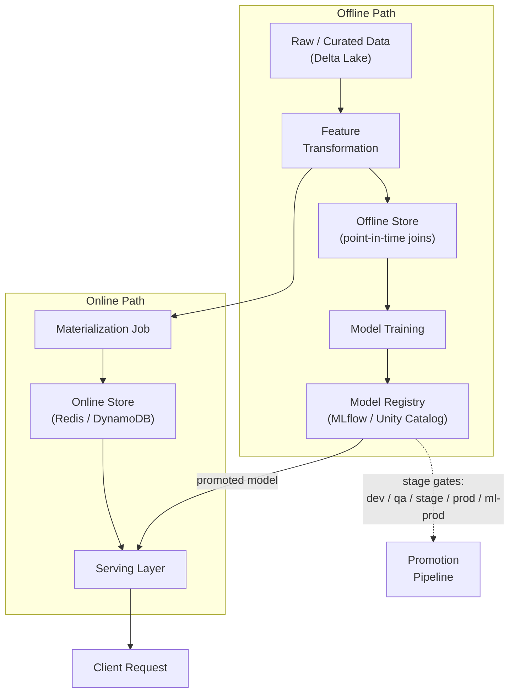

# Feature Store + Multi-Environment Model Promotion

**Weeks 5-6 of Track B.** Anchor: your production ML platform (dev/qa/stage/prod/ml-prod,
Unity Catalog, MLflow). Name **Feast** as the standard tool when asked "what would you use
instead of hand-rolling this." If you're weighing whether a feature store is worth building
at all — especially when feature reuse across models looks low — see the
[Is a Feature Store Worth It When Reuse Is Low?](03_feature_store_model_promotion_is_a_feature_store_worth_it.md) deep-dive.

## Core Concepts

### Features vs. Labels vs. Predictions — Resolve This First

A large fraction of feature-store confusion — including "does inference even have real
values to work with?" — traces back to conflating three genuinely distinct things. Get
this straight before anything else in this tutorial will click:

- **Features**: inputs to the model — facts about the world that are knowable *right now*,
  independent of the outcome being predicted (a card's 30-day average transaction amount,
  a user's account age, purchases in the last 7 days). These describe observable history
  and context, not a guess about the future.
- **Labels (actuals)**: the ground-truth outcome, knowable only *after the fact* — often
  much later (whether a transaction was actually fraud, confirmed only if a chargeback
  happens weeks on). Labels are used **only during training**, never at inference — if you
  already had the true answer, you wouldn't need a prediction.
- **Predictions**: the model's output at inference time — its guess at the still-unknown
  label, computed *from* the features. Predictions are **not features** and are **not
  stored in the feature store** — they're written to a separate prediction/decision log.

**Why inference genuinely has real values to work with, no waiting required**: inference
never asks the feature store for the outcome — it asks for the *inputs*, and those are
fully knowable the instant a request arrives. "What's this card's rolling 30-day average
transaction amount, right now?" doesn't depend on whether *this* transaction turns out to
be fraud; it's a fact about the past, continuously kept current by a background pipeline
that ingests events and updates the aggregate. The online store just answers "what is that
already-computed fact's current value" in milliseconds — it was never being asked to
predict anything.

**The full loop, concretely** (fraud detection): (1) a transaction arrives, the model calls
`get_features(card_id)` and gets real, current, already-known values from the online
store; (2) the model computes a **prediction** from those features, written to a
prediction log, not the feature store; (3) weeks later, a chargeback resolves the actual
**label**; (4) that label, joined via a point-in-time lookup against what the features
*were at that moment* (the offline store — see below), becomes one training example for
the next model version. Features flow into both training and inference; labels only ever
flow into training; predictions flow out of inference and are never fed back in as if
they were features.

### Why Inference Needs a Store at All, Not Just Live Computation

The natural next question: if inference only needs *inputs* (features), why not have the
serving code just compute them itself, live, straight from raw data — why does that
require a "store"?

**Because most useful features are aggregations over history, and aggregating history live
is slow.** "30-day average transaction amount" isn't a field sitting somewhere — it's a
computation over potentially thousands of raw transaction rows for that entity. Running
that aggregation fresh on every live request means scanning and summing raw historical
data inside a request's latency budget (tens of milliseconds) — the same cost problem an
[index avoids in the prerequisite-concepts
primer](../00_prerequisite_concepts/02_data_and_consistency.md#indexing-why-databases-dont-scan-everything),
one level up: instead of an index avoiding a per-query table scan, feature
**materialization** avoids a per-request aggregation.

**The online store holds the already-computed result, not raw data waiting to be
processed.** A background job (batch or streaming) continuously recomputes each feature's
aggregate as new events arrive, and writes the *result* into the online store. A live
request then does a cheap point lookup of an already-computed number instead of triggering
an expensive aggregation on the spot — this is exactly what "materialization" means later
in this tutorial: "keeping serving-time lookups fast without recomputing on the fly." That
phrase is the complete answer to "why does inference need a store at all."

**Even a feature that's cheap to compute live** (a static field needing no aggregation,
like account age) still benefits from going through the feature store, for a separate
reason: using the *same* shared pipeline that populates the offline store — rather than
serving code independently reimplementing the logic — is what prevents the
training-serving skew covered next. Speed motivates precomputation; consistency motivates
routing even cheap features through the shared pipeline anyway.

### Why Feature Stores Exist: Training-Serving Skew

The problem a feature store solves isn't storage — it's guaranteeing that the exact same
feature computation logic produces the value used at training time *and* the value used
at serving time. When these drift apart (a classic cause: training computes a feature in a
batch Spark job, serving recomputes "the same" feature in an online service with subtly
different logic or a different data snapshot), you get **training-serving skew** — a model
that looked great offline and quietly underperforms in production, often without any
obvious error to alert on.

### Offline Store vs. Online Store

- **Offline store** (e.g. a Delta Lake / data warehouse table): holds the full historical
  feature values, used for generating training datasets via **point-in-time joins** — for
  each training label, join in feature values *as they existed at that label's timestamp*,
  not the current value. Getting this wrong (using today's feature value to train on
  yesterday's label) is called **label leakage** and silently inflates offline accuracy in
  a way that never survives contact with production.
- **Online store** (e.g. Redis/DynamoDB): holds only the *latest* feature values, optimized
  for low-latency point lookups at serving time (`get_features(entity_id)` in single-digit
  milliseconds).
- **Both stores are populated by the same feature transformation pipeline** — this shared
  definition is the actual mechanism that prevents training-serving skew; the stores are
  just two different indexes over the same logical feature values.

### Decision Framework: When Do You Actually Need an Online Store?

It's easy to read "offline store vs. online store" as if both are always required — they
aren't, and confusing "a feature store" with "an online feature store" is the single most
common source of overbuilding here. **Of the feature store's core benefits — skew
prevention, point-in-time-correct training joins, discoverability/governance, and reuse —
only real-time serving requires an online store at all.** The other three are fully
realized by a governed offline store alone, materialization job and all.

**The one question that decides it**: does a live, user-facing request need this feature's
*current* value in milliseconds, at request time?

- **No (batch scoring)** — a nightly fraud-review queue, a daily churn score, a weekly
  recommendation refresh: the scoring job reads straight from the offline store (or a
  query engine on top of it). There's no latency pressure — minutes is fine — so an online
  store buys nothing. Skip it entirely.
- **Yes (real-time serving)** — a live transaction needs an approve/deny decision *now*,
  or a feed load needs ranking *now*: computing the feature from scratch (a fresh
  warehouse query or aggregation) takes hundreds of milliseconds to seconds, too slow for
  a typical <50-100ms serving budget. An online store exists specifically to answer
  `get_features(entity_id)` — a **point lookup by one key** — in single-digit
  milliseconds, a fundamentally different access pattern from the scans/joins/aggregations
  the offline store is built for.

| Criterion | Favors offline-only | Favors adding an online store |
|---|---|---|
| Serving latency budget | Minutes to hours (batch job) | Tens of milliseconds (live request) |
| Query pattern | Scan/join/aggregate across many entities | Point lookup by a single entity ID |
| Freshness requirement | Daily/periodic materialization is fine | Needs last-few-minutes recency |
| Ops appetite | None extra needed | Real — replication, hot-key handling, capacity planning become your problem |

**Never having used an online store is the normal case, not a gap.** Most production ML
systems are batch-scored, and batch scoring never needs sub-millisecond lookups because
nothing live is waiting on it. Real-time, online-store-backed serving is a specific shape
(fraud-at-transaction-time, real-time ad ranking, live personalization) — not the default
one. For the fuller version of this reasoning, including what to build first even once you
*do* need the governance/skew-prevention benefits without needing an online store yet, see
the [companion deep-dive on whether a feature store is worth it at
all](03_feature_store_model_promotion_is_a_feature_store_worth_it.md#the-practical-recommendation-you-probably-dont-need-the-heavy-version).

### Feast's Architecture (the name-drop, with substance behind it)

Feast is the standard open-source feature store because it's explicitly *not* a database —
it's a thin registry + retrieval layer over stores you already have:

- **Feature definitions** live as versioned Python objects (`FeatureView`, `Entity`) in a
  repo — this is what makes feature definitions reviewable and testable like any other
  code, and gives you a single source of truth referenced by both training and serving.
- **The registry** stores metadata (schemas, ownership, freshness SLAs), not the feature
  values themselves.
- **Materialization** is the batch/scheduled job that pushes feature values from the
  offline store into the online store, keeping serving-time lookups fast without
  recomputing on the fly.
- Feast deliberately doesn't replace Delta Lake or Redis — it sits on top of them, which is
  exactly why it's a lower-lift adoption than a fully proprietary feature-store platform.

### Environment Promotion: dev → qa → stage → prod → ml-prod

The extra `ml-prod` stage beyond a standard software promotion pipeline exists because ML
artifacts have a validation need standard code doesn't: **a model can be perfectly
"correct" code-wise and still be a bad model** (wrong metrics, drifted training data, a
regression versus the currently-deployed model on a held-out set). Promotion through each
stage should gate on a different kind of check:

| Stage | Gate |
|---|---|
| dev | Unit tests, feature pipeline runs end-to-end on sample data |
| qa | Integration tests, schema validation against the full feature store |
| stage | Full-scale shadow evaluation — score real (or replayed) traffic, compare metrics against the current prod model, no user-facing impact |
| prod (data/feature layer) | Data pipeline promoted; feature freshness SLAs monitored |
| ml-prod (model layer) | Model artifact promoted *separately* from the data pipeline — canary/shadow deployment (see [Model Serving tutorial](04_model_serving_deployment.md)), offline metrics **and** online metrics both meet threshold |

The key idea to state explicitly: **the model artifact and the feature/data pipeline are
promoted on separate tracks with separate gates**, because a good pipeline can still ship a
bad model, and a good model can still be broken by a bad pipeline — conflating the two
gates hides which one actually failed when something goes wrong.

### Model Registry (MLflow / Unity Catalog)

- Tracks model **versions**, their **stage** (staging/production/archived), **lineage**
  (which training run, which data version, which feature definitions produced this model),
  and **metrics** at each version.
- Unity Catalog extends this with **governance**: who can promote a model to production,
  audit trails on stage transitions, and unified access control across the feature tables
  and model artifacts together (rather than two separate permission systems to reconcile).
- The registry is what makes "roll back to the previous model version" a metadata
  operation (repoint the serving layer's alias) instead of a redeploy — always mention this
  when discussing rollback strategy.

> **This promotion pipeline and the observability stack that watches production aren't two
> separate systems** — see [Designing Promotion and Observability as One Closed-Loop
> System](05_observability_drift_closed_loop_promotion_and_monitoring.md) for why
> treating them as one system, with a single shared metric contract, is what separates a
> senior design from a staff one.

## Reference Architecture

## Deep-Dive: Point-in-Time Joins (the trickiest part to get right)

Walk through this explicitly if it comes up — it's the single most common source of subtle
bugs in feature store design:

1. You have a table of **labels** (`entity_id`, `label`, `event_timestamp`).
2. You have a table of **feature values** (`entity_id`, `feature_value`,
   `feature_timestamp`) that changes over time — e.g. "user's 7-day purchase count."
3. A naive join (`entity_id` only) grabs whatever the *current* feature value is — this
   leaks future information into training if the feature has changed since the label was
   generated.
4. The correct join is: for each label row, find the feature row with the **latest
   `feature_timestamp` that is still ≤ the label's `event_timestamp`** — this reconstructs
   "what the feature value actually was at the moment the label was generated."
5. This is computationally more expensive (a temporal join, not a simple key join) — which
   is exactly why a purpose-built offline store implementation (rather than a hand-rolled
   SQL join every time) is worth having, and why "point-in-time correctness" is a
   headline feature when evaluating any feature store tool.

## Deep-Dive: Derived Features and Versioning a Transformer That Changes Over Time

A pattern that comes up constantly and isn't obvious from the primary-feature discussion
above: a **primary feature** (a raw computed value — a category, a count, an amount) often
isn't fed to the model directly. It first passes through a **fitted transformer** —
one-hot encoding, a scaler, an embedding model — whose own parameters (which categories
exist, a mean/std, learned weights) come from fitting on data, and get periodically
refit as new data arrives. The key reframe: **that fitted transformer is a versioned
artifact, exactly like a model** — not a stateless formula — so managing it is a
versioning problem, not a storage problem.

**Why this is training-serving skew, one layer up**: if training uses a transformer fit on
last month's data while serving is still running one fit three months ago, the
*transformation step itself* diverges between training and serving, even if the
underlying primary feature values are perfectly consistent. This is the same class of bug
as the skew problem covered earlier, just moved one stage downstream in the pipeline.

**The pattern that eliminates the risk by construction — bundle the transformer with the
model as one artifact.** Rather than versioning "primary feature → transformer → model" as
three independently-moving pieces, package the fitted transformer as the first stage of
the model's own serialized pipeline (e.g. a scikit-learn `Pipeline` combining the encoder
and the model into one object) and version, promote, and roll back that single artifact
through the same [promotion pipeline already covered](#environment-promotion-dev-qa-stage-prod-ml-prod)
in this tutorial. There's no such thing as "model v10 paired with encoder v7" drifting out
of sync with "model v10 paired with encoder v8," because encoder and model were never
separably versioned to begin with — this is the default choice unless the transform is
expensive enough to need the next pattern.

**When the transform is too expensive to recompute per request, materialize its output as
a derived feature instead** — the same materialization argument as any other feature, just
one layer downstream. This reintroduces the versioning problem explicitly: the feature
store now has to track *which transformer version* produced each materialized value, and
refitting the transformer means **backfilling every materialized derived feature**, not
patching a config in place. Treat a transformer refit exactly like any other
materialization-logic change — a full re-materialization run, not an in-place swap.

**Treat a transformer refit as its own promotion event**, reusing the model-promotion
machinery rather than hot-swapping it silently: does the new fit meaningfully change
encodings for categories that already existed? Does downstream model performance,
evaluated *with* the new transformer, hold up against a held-out set before it replaces
the production version? A transformer that quietly changes what it outputs for existing
inputs is exactly as dangerous as a model that regresses without anyone noticing.

**The specific "a new category shows up" problem** (a real, concrete headache for one-hot
encoding specifically): a fixed-vocabulary encoder fit on historical data breaks or
silently mishandles a category it's never seen. Two standard mitigations that avoid
needing a refit every time new data introduces one: reserve an explicit **unknown/other**
bucket in the encoding scheme (simple, small accuracy cost), or use **feature hashing**
instead of a fixed vocabulary (a small collision risk, but no fixed vocabulary means new
categories never break inference, sidestepping the refit-consistency problem for this
specific case entirely).

## Trade-offs

| Decision | Option A | Option B | When to pick which |
|---|---|---|---|
| Online store | Redis (in-memory, lowest latency) | DynamoDB (managed, scales without ops, slightly higher latency) | Redis when you control the ops burden and need sub-ms lookups; DynamoDB when you want managed scaling and ms-level latency is acceptable |
| Feature freshness | Real-time streaming updates to online store | Periodic batch materialization | Real-time only for features that meaningfully change within your serving latency window (e.g. "last 5 minutes of activity") — batch is sufficient and far simpler for slowly-changing features |
| Promotion gate strictness | Automated gates only (fast, consistent) | Manual sign-off required at ml-prod (slower, adds human judgment) | Manual sign-off for high-blast-radius models (pricing, fraud); automated-only for low-risk, easily-rolled-back models |
| Feature definition ownership | Centralized platform team owns all definitions | Decentralized — each ML team owns their own feature definitions | Centralized when consistency/governance matters most; decentralized when velocity matters most and teams are mature enough to self-govern |

## Failure Modes to Raise Proactively

- **Training-serving skew** from divergent online/offline feature computation logic —
  mitigated by a single shared feature definition materialized to both stores.
- **Label leakage** from naive (non-point-in-time) joins — mitigated by explicit temporal
  join logic, tested against known-good historical cases.
- **Stale online features** if the materialization job falls behind or fails silently —
  mitigated by freshness SLA monitoring and alerting on materialization lag, not just job
  success/failure.
- **A model artifact promoted without its corresponding feature definitions being in
  sync** — mitigated by versioning feature definitions alongside model versions in the
  registry's lineage metadata, so promotion can validate the pair together.

## Make It Yours

- In a production platform you've worked on, what actually triggered a promotion from
  stage to ml-prod — an automated metric threshold, a manual review, or both? What would
  you change?
- Describe a specific training-serving skew (or near-miss) you've encountered — how was it
  caught, and how long did it take to catch?
- What's the freshness SLA on your most latency-sensitive feature, and what happens when
  materialization falls behind it?

## Practice Questions

- Design a feature store supporting both real-time fraud-detection features (sub-second
  freshness) and slower-changing user-profile features (daily refresh).
- Design the promotion pipeline for a new model version from training through to
  production, including rollback.
- A model's offline evaluation metrics look great, but online performance is
  underperforming the previous version — walk through how you'd diagnose training-serving
  skew live.

## Articulate It: Interview Framing & Vocabulary

### Three Ways to Explain This

- **Trade-off-first (the default for a senior round):** "A feature store's real job isn't
  storage, it's guaranteeing that training and serving compute the same feature the same
  way. Everything else — offline/online stores, materialization, Feast — is plumbing in
  service of that one guarantee. I'd lead with the guarantee, then the plumbing."
- **Narrative-first (good for 'have you dealt with skew before'):** "We once had a model
  that looked great offline and quietly underperformed for weeks in production. It turned
  out the batch feature and the online feature used slightly different windowing logic —
  classic training-serving skew. That's the incident that made 'one shared feature
  definition, materialized to both stores' a non-negotiable for me now."
- **Systems-first framing (good when asked to design the promotion pipeline):** "I think of
  promotion as two separate tracks that happen to share a name — the data/feature pipeline
  gets promoted on data-quality gates, the model artifact gets promoted on offline-and-
  online-metric gates. Conflating them hides which one actually failed when something breaks
  in prod."

### Vocabulary Builder

**Technical shorthand — use these instead of over-explaining the concept every time:**

- **training-serving skew** (n. phrase) — a model performing differently in production than
  offline because the features it sees at serving time subtly differ from training time.
- **point-in-time join** (n. phrase) — joining a label to the feature value that existed
  *at the label's timestamp*, not the current value — the mechanism that prevents label
  leakage.
- **label leakage** (n. phrase) — accidentally training on information that wouldn't have
  been available at prediction time, inflating offline metrics in a way that never survives
  production.
- **materialization** (n.) — the scheduled job that pushes feature values from the offline
  store into the low-latency online store.
- **lineage** (n.) — the traceable record of which data, code, and feature versions
  produced a given model artifact; what makes an audit or a rollback possible.

**Expressive phrases — for stating a trade-off fluently instead of listing pros/cons:**

- **"The mechanism that actually prevents this is…"** — moves past naming a problem
  (skew, leakage) straight to the concrete fix, which is what a senior answer does.
- **conflate** (v.) — to wrongly treat two distinct things as one. *"Conflating the data
  pipeline's gate with the model's gate hides which one failed."*
- **"On a held-out set…"** — precise phrasing for describing an evaluation that wasn't
  seen during training; signals rigor over "we tested it."
- **reconcile** (v.) — to bring two divergent things back into agreement. *"Unity Catalog
  reconciles feature and model permissions under one access-control system instead of two."*
- **"That's a lower-lift adoption than…"** — a fluent way to argue for a tool (Feast) by
  comparing integration cost, not just feature checklist.

---

**Previous:** [2. High-Throughput Ingestion Pipelines](02_ingestion_pipeline.md)  |  **Next:** [4. Model Serving & Deployment](04_model_serving_deployment.md)
