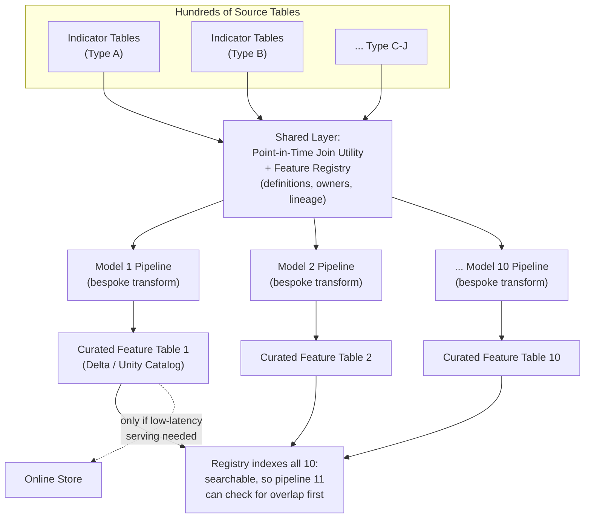

# Deep-Dive: Is a Feature Store Worth It When Reuse Is Low?

A practical companion to the [Feature Store tutorial](03_feature_store_model_promotion.md) — that tutorial assumes
you've already decided to build one and explains how. This doc answers the question that
should come *before* that: a real scenario worth reasoning through explicitly, because the
instinctive answer ("no reuse, so no feature store") is usually wrong, but for a more
interesting reason than "feature stores are always good."

## The Scenario

A database with **hundreds of tables** spanning several different types of indicators.
**Ten models**, one per indicator, where **each model's features are computed with a
different setup** — different source tables, different transformation logic, different
aggregation windows. On the surface, this looks like the case where a feature store's
classic pitch doesn't apply: if nothing is shared, what is there to "store"?

## Reframe: A Feature Store Is Four Benefits, Not One

The classic pitch — "build a feature once, reuse it across many models" — is only one of
four independent benefits, and it's the one weakest in this scenario. The other three don't
depend on reuse across models at all, and they get **more** valuable, not less, as the
number of independently-built pipelines grows:

| Benefit | Does it need cross-model reuse? | Why it still applies with 10 distinct pipelines |
|---|---|---|
| **Training-serving skew prevention** | No — this is per-model | Each of the 10 pipelines independently risks the offline (training) and online (serving) computation of "the same" feature quietly diverging. Ten bespoke pipelines is **10x the surface area** for this bug versus one shared computation path, not 10x less need for the guardrail. |
| **Point-in-time correctness** | No — this is per-pipeline | With hundreds of tables and time-varying indicators, every team hand-rolling their own "as-of" join is exactly how [label leakage](03_feature_store_model_promotion.md#deep-dive-point-in-time-joins-the-trickiest-part-to-get-right) creeps in. A shared point-in-time join utility removes that risk once instead of ten times, independent of whether the final features overlap. |
| **Discoverability & governance across hundreds of tables** | No — this scales with table count, not reuse | This is usually the *actual* biggest problem in this exact scenario (see below). |
| **Feature reuse** | Yes | Genuinely weaker here — but check whether it's really zero before assuming it (see below). |

The honest framing: **doubt the reuse argument, but don't let that stand in for doubting
the whole thing** — the other three benefits are load-bearing on their own, and this
scenario (many tables, many independently-built pipelines) is precisely the shape of system
where they matter most.

### The discoverability problem this scenario actually has

With hundreds of source tables and ten teams each building their own feature setup, the
realistic failure mode isn't "duplicate work causes some inefficiency" — it's **silent
semantic drift**: model #7's team has no way to know model #3 already computed something
80% similar from overlapping source tables, so they build a slightly different version.
Both now claim to measure roughly the same thing, both are "correct" by their own pipeline's
logic, and nothing catches the two slowly diverging until someone downstream notices the
numbers don't reconcile — often much later, and often not until it's a stakeholder-facing
discrepancy. A registry with **searchable feature definitions, owners, and lineage** is what
makes "does something like this already exist?" answerable *before* building, not a
forensic exercise after the fact.

### Check whether reuse is actually zero

"Each model's features are calculated with a different setup" describes the *final*
feature set, not necessarily the underlying building blocks. It's worth explicitly checking
whether several of the 10 indicators share an **intermediate aggregate** — e.g., more than
one indicator needing a trailing-30-day join of the same two source tables, even though
what each does with that join afterward differs. Partial reuse at the intermediate-feature
level is far more common than "10 totally distinct pipelines" first suggests, and it's easy
to miss if each team only ever looks at their own pipeline.

## The Practical Recommendation: You Probably Don't Need the Heavy Version

The temptation once convinced "a feature store helps" is to reach for the full setup from
the main tutorial — Feast, an online store (Redis/DynamoDB), real-time materialization. For
this scenario specifically, that's usually more than you need:

- **If all 10 models are batch-scored** (no sub-second lookup requirement), you don't need
  an online store at all — the skew-prevention, point-in-time-correctness, and
  discoverability benefits above all come from the **offline side**: a governed, versioned
  feature *registry* (definitions, owners, lineage) sitting on top of curated Delta
  Lake/Unity Catalog tables, plus a shared point-in-time join utility every pipeline calls
  instead of hand-rolling its own.
- **Escalate to a full online store only when a specific model actually needs low-latency
  real-time serving** — treat this as a per-model decision, not an all-or-nothing platform
  choice; it's entirely reasonable for 8 of the 10 indicator models to stay batch-only while
  2 graduate to online serving if and when that requirement shows up.
- **The registry is the part to build first, regardless of scale** — it's the cheapest piece
  and the one that directly addresses the actual biggest risk in this scenario (silent
  semantic drift across independently-built pipelines), before investing in materialization
  infrastructure nothing yet requires.

## Reference Architecture for This Scenario

The key structural point this diagram is making: **the bespoke transformation logic per
model stays bespoke** — a feature store doesn't force convergence on ten genuinely different
feature sets — but the **join mechanics and the catalog are shared**, which is where the
actual risk (skew, leakage, silent duplication) lives.

## Trade-offs

| Decision | Option A | Option B | When to pick which |
|---|---|---|---|
| Scope | Full feature-store platform (Feast, online store, materialization) up front | Registry + shared point-in-time join utility first, online store added per-model later | Start with B for this scenario — none of the four benefits except low-latency serving requires the online store, and it's the most expensive piece to run |
| Feature definition ownership | Centralized platform team defines all 10 | Each model team owns their own definitions, registered centrally | Decentralized ownership registered centrally usually fits this scenario best — the bespoke setups suggest real domain differences per indicator, but the registry still needs to be one shared source of truth so overlap is visible |
| When to add an online store | Never, if all consumers are batch | Per-model, the moment one needs sub-second lookups | Treat as a per-model escalation, not a platform-wide decision made once for all 10 |

## Failure Modes to Raise Proactively

- **Silent semantic drift between "similar but not identical" indicators built by different
  teams** — the concrete risk this scenario carries more than most; mitigated by a
  searchable registry checked *before* building a new pipeline, not just documentation
  written *after*.
- **Each of the 10 teams hand-rolling its own as-of join, with 10 independent chances to get
  it wrong** — mitigated by one shared, tested point-in-time join utility all 10 pipelines
  call, even though their downstream transformation logic differs completely.
- **Building the full online-store platform before any model needs it** — real cost and
  operational burden paid for a benefit (low-latency serving) that may never be needed by
  most of the 10 models; mitigated by treating online-store adoption as a per-model,
  demand-driven decision.
- **Assuming zero reuse without checking** — worth an explicit audit of the 10 pipelines'
  intermediate aggregates before concluding there's nothing to share; the assumption is
  usually wrong at the intermediate-feature level even when it's right at the final-feature
  level.

## Make It Yours

- In the database you're describing, have you actually audited whether any of the 10
  indicator pipelines share an intermediate join or aggregate — or is "no reuse" an
  assumption nobody's checked?
- Has silent semantic drift between two similar-but-not-identical computed values ever
  actually happened on a system you've worked on — how was it caught, and how long had it
  been drifting?
- Of the 10 models, how many are genuinely batch-scored versus needing low-latency lookups
  — does that split change which parts of this you'd actually build first?

## Practice Questions

- You're told "we have 10 models and no feature reuse, so a feature store won't help" —
  push back on this framing out loud, the way you would in an interview.
- Design the minimal version of a feature registry for this scenario that captures 80% of
  the governance/discoverability benefit without building an online store.
- Two of the 10 indicator models produce numbers that should theoretically reconcile but
  don't — walk through how you'd diagnose whether it's a genuine methodology difference or
  silent pipeline drift.

## Articulate It: Interview Framing & Vocabulary

### Three Ways to Explain This

- **Reframe-first (the default when the interviewer poses the 'no reuse, so no feature
  store' trap):** "I'd push back on the framing before answering — a feature store is four
  benefits bundled under one name, and reuse is the weakest of the four here. Skew
  prevention and point-in-time correctness are per-pipeline benefits that get *more*
  valuable as you add independently-built pipelines, not less."
- **Risk-first (good for 'what actually breaks in this scenario'):** "With ten teams
  building bespoke pipelines off hundreds of shared tables, the real risk isn't wasted
  effort — it's silent semantic drift. Two teams build something 80% similar, both look
  correct in isolation, and nothing catches the divergence until a stakeholder notices the
  numbers don't reconcile."
- **Scoped-recommendation framing (good for 'so what would you actually build'):** "I
  wouldn't reach for the full platform. I'd build the registry and the shared point-in-time
  join utility first — that's the cheapest piece and it directly addresses the biggest risk
  — and treat the online store as a per-model escalation, not an upfront platform decision."

### Vocabulary Builder

**Technical shorthand — use these instead of over-explaining the concept every time:**

- **semantic drift** (n. phrase) — two independently-built definitions of "the same thing"
  slowly diverging without anyone noticing, until the outputs stop reconciling.
- **intermediate aggregate** (n. phrase) — a shared computational building block (e.g. a
  30-day trailing join) reused inside otherwise-distinct pipelines, even when their final
  outputs look nothing alike.
- **build-vs-buy** (n. phrase) — the decision to hand-roll infrastructure versus adopting an
  existing tool; here, applied at a finer grain than usual — build the registry, defer the
  online store.
- **discoverability** (n.) — whether an engineer can find out something already exists
  before building a duplicate; the property a searchable registry provides.

**Expressive phrases — for stating a trade-off fluently instead of listing pros/cons:**

- **"Don't let doubting one part stand in for doubting the whole thing…"** — a precise way
  to push back on an all-or-nothing framing without sounding contrarian for its own sake.
- **bespoke** (adj.) — custom-built for one specific case rather than shared or generic.
  *"Each of the ten pipelines is bespoke, but the join mechanics underneath don't have to
  be."*
- **forensic** (adj.) — after-the-fact investigation to reconstruct what happened. *"Without
  a registry, 'does this already exist' becomes a forensic exercise instead of a quick
  search."*
- **"That's genuinely weaker here — but let me check before assuming it's zero…"** — models
  intellectual honesty: concede the weak point, then verify rather than assume.
- **load-bearing** (adj.) — something the rest of the argument actually depends on, not
  decorative. *"The other three benefits are load-bearing on their own."*

---

**See also:** [3. Feature Store + Model Promotion](03_feature_store_model_promotion.md) ·
[Data Governance Deep-Dive](10_cost_security_multiregion_data_governance_deep_dive.md)
(the cataloging/lineage discussion there applies directly to the "hundreds of tables"
half of this problem)
