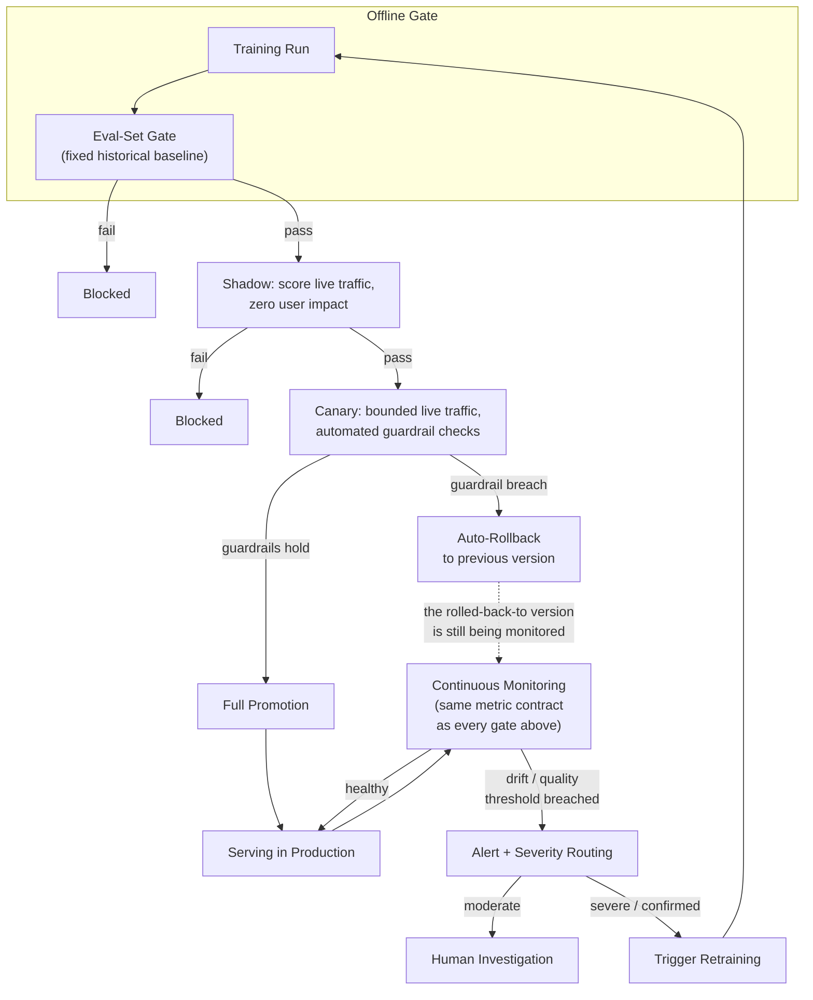

# Deep-Dive: Designing Model Promotion and Observability as One Closed-Loop System

A practical companion to the [Feature Store & Model Promotion
tutorial](03_feature_store_model_promotion.md), the [Model Serving
tutorial's canary deep-dive](04_model_serving_deployment.md#deep-dive-designing-the-canary-evaluation-loop),
and the [Observability & Drift tutorial](05_observability_drift.md) — each of those treats one piece of
this system in isolation. This doc is the piece that's usually missing from a senior
answer and present in a staff one: **promotion and observability aren't two systems that
hand off to each other, they're one system with a single continuous feedback loop**, and
designing them separately is exactly how the [canary-passed-but-P1-two-days-later
scenario](12_tricky_scenarios_02_canary_passed_p1_later.md) and the [silent-drift
scenario](12_tricky_scenarios_03_silent_drift_no_alert.md) actually happen in
production.

## The Reframe: Observability *Is* the Gate, Not a Downstream Concern

The instinctive design (and the one a senior answer typically stops at): build a
promotion pipeline with its own gates (offline eval, shadow, canary), ship the model, and
*then* set up monitoring to watch it in production — two projects, built and often owned
by two different people, connected by nothing more than "the model is now live."

The staff-level reframe: **every stage of promotion is itself a monitoring problem**, just
at different time horizons and different blast radii. An offline eval gate is monitoring
against a fixed historical baseline. A shadow gate is monitoring live traffic with zero
user impact. A canary gate is monitoring live traffic with bounded user impact. Post-
promotion drift monitoring is exactly the same kind of check, just continuous instead of
one-time, and *its own trigger condition* (drift detected) has to lead back into the same
promotion pipeline for the retrained candidate, not a separate ad hoc process. Once framed
this way, "how do I design promotion" and "how do I design observability" become the same
question asked at different points in one loop.

## Reference Architecture: The Full Loop

**The detail that makes this a loop, not a pipeline**: the output of `Monitor` feeds back
into `Train`, and a retrained candidate goes through the *exact same* `EvalGate → Shadow →
Canary → FullPromote` sequence as any other candidate — it does not get a shortcut because
it was triggered by drift. This is the direct answer to the failure mode named in the
[observability tutorial's deep-dive](05_observability_drift.md#deep-dive-designing-the-drift-to-retrain-feedback-loop):
"auto-triggered retraining should still require human approval before promotion, since a
retrained model isn't automatically a better one" — the loop diagram above is what makes
that statement an architectural constraint instead of a policy someone has to remember.

## Deep-Dive: The Unified Metric Contract

**The problem this solves**: in the [canary-passed-P1-two-days-later
scenario](12_tricky_scenarios_02_canary_passed_p1_later.md), the canary's guardrails
checked latency, error rate, and prediction distribution — infra-health signals — while
the actual regression was a business metric (click-through rate) that nobody thought to
check until a weekly dashboard caught it. The root cause wasn't a bad canary
*implementation* — it was that the canary stage and the post-promotion monitoring stage
were defined with **two different, disconnected sets of metrics**.

**The fix, as a design principle**: define one **metric contract** per model — the full
set of infra-health, prediction-quality, and business-outcome metrics that matter for that
model — once, in one place (versioned alongside the model in the registry, per the
[feature store tutorial's registry
discussion](03_feature_store_model_promotion.md#model-registry-mlflow-unity-catalog)),
and reference that *same* contract at every stage: the offline eval gate scores against
it, the shadow stage scores against it, the canary's guardrails are drawn from it, and
post-promotion continuous monitoring alerts against it. A metric that isn't in the
contract doesn't quietly get checked at one stage and skipped at another — it's either in
the contract everywhere, or it's not tracked at all, which is itself a visible gap to
fill rather than a silent one.

**Why this is harder than it sounds**: business metrics like CTR are often slow to
compute (need real user interaction, not just a prediction) and expensive to compute
per-canary-request in real time. The practical resolution: define **fast proxy metrics**
that correlate with the slow business metric (e.g., prediction-distribution shift as a
fast proxy for an eventual CTR change) for use at the canary stage, but validate
periodically that the proxy still actually correlates with the real metric — a proxy that
silently stops correlating with what it's a proxy *for* is its own quiet failure mode.

## Deep-Dive: Where to Automate, and Where to Keep a Human in the Loop

Not every stage in the loop deserves the same level of automation — the design question is
principled, not "automate everything" or "human-gate everything":

| Stage | Automate? | Why |
|---|---|---|
| Offline eval gate | Fully automated | Deterministic, reproducible, zero user-facing blast radius if wrong |
| Shadow evaluation | Fully automated | Zero user impact by construction — there's no downside to trusting the automated pass/fail |
| Canary ramp-up steps | Automated ramp, automated rollback on guardrail breach | Blast radius is bounded and shrinks fast on rollback — the [model-serving tutorial's canary deep-dive](04_model_serving_deployment.md#deep-dive-designing-the-canary-evaluation-loop) argues automated rollback beats waiting for a human to notice |
| Canary → full promotion | Human sign-off for high-blast-radius models; automated for low-stakes, easily-rolled-back ones | Mirrors the [promotion-gate-strictness trade-off already in the feature store tutorial](03_feature_store_model_promotion.md#trade-offs) — the risk profile of the model, not a fixed rule, should decide this |
| Drift detection → retrain trigger | Automated | Retraining itself is cheap and reversible — triggering it costs compute, not correctness |
| Retrained candidate → promotion | **Never skip the gates** — same automated/human mix as any other candidate, per model risk | This is the single most important rule in this whole doc: a drift-triggered retrain earns no shortcut through promotion |

**The organizing principle**: automate whatever is cheap to be wrong about and fast to
undo; keep a human in the loop wherever being wrong is expensive, slow to detect, or hard
to reverse. Stating this principle explicitly — rather than a stage-by-stage list someone
has to memorize — is what lets you reason about a *new* stage this diagram doesn't cover
yet, which is exactly the kind of generalization a staff-level design conversation rewards.

## Trade-offs

| Decision | Option A | Option B | When to pick which |
|---|---|---|---|
| Loop automation level | Fully automated closed loop (fast, self-healing) | Human-gated at every stage (slower, safer) | Full automation once guardrails are proven reliable and rollback is cheap; human-gating for high-stakes models or a newly-built loop that hasn't earned trust yet |
| Metric contract scope | One shared contract per model, used everywhere | Stage-specific metrics, tailored per stage | Shared contract is the default — stage-specific metrics are how the CTR gap in scenario 02 happens; only diverge deliberately, not by accident |
| Drift response | Reactive (retrain only when drift crosses a threshold) | Proactive (revalidate on a schedule regardless of drift signal) | Reactive is cheaper and standard; add scheduled revalidation for models where a missed/false-negative drift signal would be especially costly |
| Rollback vs. retrain on a guardrail breach | Rollback to the last known-good version immediately | Trigger a fresh retrain before deciding | Rollback first, always — it's fast and reversible; retraining is a separate, slower decision that shouldn't block restoring service |

## Failure Modes to Raise Proactively

- **Automated-action flapping**: a noisy metric crosses a threshold, triggers rollback;
  the rolled-back state looks healthy, triggers re-promotion; the same noise triggers
  rollback again. Mitigate with **hysteresis** — require a metric to stay past a threshold
  for a sustained window, not a single reading, before triggering an automated action
  (the same discipline already named for [alert fatigue in the observability
  tutorial](05_observability_drift.md#failure-modes-to-raise-proactively)), plus a cooldown period after
  any automated action before the *next* one is allowed to fire.
- **The metric-contract gap** — a guardrail set at one stage that doesn't match the
  contract used at another, the direct mechanism behind [scenario
  02](12_tricky_scenarios_02_canary_passed_p1_later.md). Mitigate by defining the
  contract once, versioned with the model, referenced (not redefined) at every stage.
- **A proxy metric that's silently stopped correlating with what it proxies for** —
  the canary stage's fast proxy for a slow business metric can drift away from that
  metric's actual behavior over time without anyone noticing, since the proxy itself
  still looks "fine." Needs periodic, explicit revalidation of the proxy-to-real-metric
  correlation, not a one-time check at design time.
- **Silent degradation of the loop itself** — the loop can keep executing (drift
  detected, retrain triggered, promotion gates passed) while the *baseline* those gates
  compare against has itself quietly drifted, so a genuinely worse model keeps passing.
  Mitigate with a periodic, human-reviewed audit of the baseline itself, independent of
  the automated loop's own pass/fail signal.

## Make It Yours

- In a promotion pipeline and a monitoring setup you've worked on, were they actually the
  same system, or two projects that happened to hand off to each other? What would
  unifying them under one metric contract have caught?
- Has an automated rollback or retrain trigger you've built ever flapped, or come close?
  What would hysteresis/cooldown have changed?
- Pick one stage in the loop diagram above — would you automate it or keep a human in the
  loop for a system you've actually worked on, and why that specific call?

## Practice Questions

- Design the metric contract for a fraud-detection model — what goes in it, and which
  metrics are fast enough to check at canary time versus only computable after a delay?
- A drift-triggered retrain has just produced a new candidate model — walk through exactly
  what gates it passes through before reaching production, and justify which ones are
  automated.
- Design the hysteresis/cooldown logic for an automated rollback system so that a single
  noisy metric reading can't trigger a rollback, but a genuine regression still triggers
  one within an acceptable time window.

## Articulate It: Interview Framing & Vocabulary

### Three Ways to Explain This

- **Reframe-first (the default, and the actual senior-to-staff signal here):** "I wouldn't
  design promotion and observability as two systems that hand off to each other — every
  stage of promotion is itself a monitoring problem, just at a different time horizon and
  blast radius. I'd say that framing out loud before drawing anything."
- **Root-cause framing (good for explaining why this matters, not just that it does):**
  "The canary-passed-but-broke-two-days-later failure mode isn't a canary implementation
  bug — it's that the canary stage and post-promotion monitoring were defined with two
  disconnected sets of metrics. One shared metric contract, referenced everywhere instead
  of redefined per stage, is the actual fix."
- **Principled-automation framing (good for the human-in-the-loop discussion):** "I
  wouldn't answer 'should this be automated' stage by stage from memory — I'd apply one
  principle: automate whatever's cheap to be wrong about and fast to undo, keep a human
  where being wrong is expensive or hard to reverse. That's what lets me reason about a
  new stage this diagram doesn't cover yet."

### Vocabulary Builder

**Technical shorthand — use these instead of over-explaining the concept every time:**

- **metric contract** (n. phrase) — the single, versioned set of metrics a model is
  evaluated against, referenced identically at every promotion stage rather than
  redefined ad hoc per stage.
- **proxy metric** (n. phrase) — a fast, cheaply-computed signal that correlates with a
  slow or expensive-to-compute real metric (e.g. prediction shift as a proxy for eventual
  CTR change); needs periodic revalidation that the correlation still holds.
- **hysteresis** (n., borrowed from controls/electronics) — requiring a signal to stay past
  a threshold for a sustained window before acting on it, to prevent an automated action
  from flapping on noise.
- **closed loop** (n. phrase) — a system where output (monitoring) feeds back into input
  (retraining and re-promotion) automatically, as opposed to a linear pipeline that ends
  once a model ships.

**Expressive phrases — for stating a trade-off fluently instead of listing pros/cons:**

- **"…earns no shortcut through promotion"** — a sharp, quotable way to argue that an
  automated trigger (drift-based retraining) shouldn't reduce the rigor a candidate is
  evaluated with, just because it arrived automatically.
- **"…is what makes that statement an architectural constraint instead of a policy someone
  has to remember"** — a fluent way to argue that a diagram/design enforces a rule
  structurally, rather than relying on a human remembering a guideline.
- **flap** (v.) — to oscillate between states rapidly and unproductively. *"A noisy metric
  can make an automated rollback flap between rolled-back and re-promoted."*
- **"…is its own quiet failure mode"** — useful for flagging a second-order risk (a proxy
  metric silently decorrelating, a baseline silently drifting) that isn't caught by the
  system's own primary monitoring.

---

**See also:** [3. Feature Store & Model Promotion](03_feature_store_model_promotion.md) ·
[4. Model Serving & Deployment](04_model_serving_deployment.md) ·
[5. ML/LLM Observability & Drift](05_observability_drift.md) ·
[Tricky Scenario: Canary Passed, P1 Two Days Later](12_tricky_scenarios_02_canary_passed_p1_later.md) ·
[Tricky Scenario: Silent Drift, No Alert](12_tricky_scenarios_03_silent_drift_no_alert.md)
