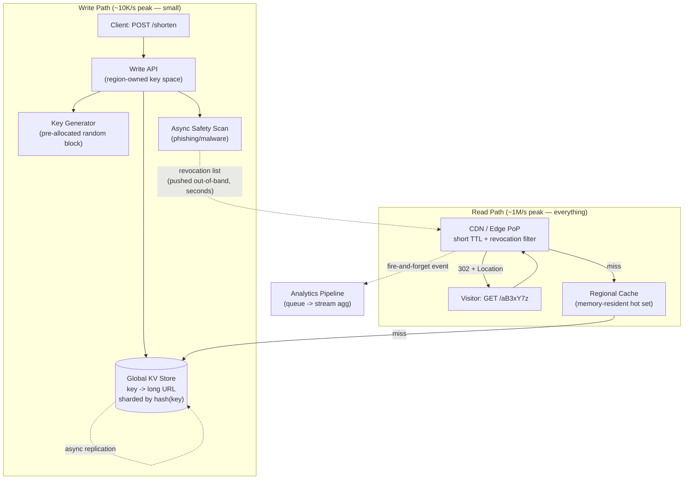

# Design a URL Shortener (TinyURL / bit.ly / goo.gl)

**Primarily tests**: whether you can find the hard problems in a deceptively easy
question. Everyone knows the textbook answer — base62-encode a counter, store the mapping,
redirect — and that answer is worth roughly nothing above senior level. The real
evaluation is on four things the textbook version never mentions: **key generation as a
security property** (not just an encoding choice), **revocation racing against a globally
cached read path**, **write-path partitioning that avoids consensus entirely**, and the
**permanence obligation** you take on the moment your first link is published.

This is the classic warm-up question at Google/Meta/Amazon precisely *because* it's easy
to answer badly-but-plausibly. Interviewers use it to separate candidates who recite a
design from candidates who interrogate one.

## Clarify

- **Scale, in both directions separately.** Reads and writes differ by orders of magnitude
  here, and conflating them is the first mistake. Assume **100M new links/day** (~1.2K/s
  average, ~10K/s peak) against **10B redirects/day** (~115K/s average, ~1M/s peak during a
  televised event) — a **~100:1 read:write ratio**. Nearly every design decision below
  follows from that asymmetry.
- **Is the short key allowed to be guessable?** This sounds cosmetic and is actually the
  most consequential question in the problem. If links are unlisted-but-sensitive (a shared
  document, a password reset, an invoice), a sequential counter means anyone can enumerate
  every link your service has ever issued by counting. Assume **keys must be
  non-enumerable**.
- **Custom aliases?** Assume yes — and note immediately that they're a *different system*
  from generated keys (they need global uniqueness checks, squatting protection, and
  trademark/abuse review), just a low-volume one.
- **Link lifetime.** Do links expire, or is the contract "this works forever"? Assume
  forever by default with optional TTL — then say out loud what that commits you to
  (see [the permanence obligation](#deep-dive-the-permanence-obligation)).
- **Revocation latency requirement.** When a link is found to be phishing, how fast must it
  stop resolving *globally*? Assume **seconds, not hours** — this single number invalidates
  the naive "cache redirects at the CDN with a long TTL" answer.
- **Analytics requirements**: real-time or batch? Exact or approximate? Assume near-real-time
  and **explicitly approximate** for uniques.
- **Latency SLO**: redirect p99 **< 50ms globally**, since the redirect sits on the critical
  path of someone else's page load.

## Requirements

Restating the clarified assumptions as an explicit FR/NFR split is what turns "I asked good
questions" into "I have a spec I can be held to" — every deep-dive below traces back to one
row in this table, and a staff answer should be able to point to which requirement is
driving which design decision.

### Functional Requirements

| # | Requirement |
|---|---|
| FR1 | Given a long URL, generate a unique short key and return the short link |
| FR2 | Given a short key, redirect to the original long URL |
| FR3 | Support user-chosen custom aliases, subject to uniqueness and abuse review |
| FR4 | Support optional link expiration (TTL); default is no expiration |
| FR5 | Allow a link's owner (or an abuse reviewer) to revoke a link so it stops resolving |
| FR6 | Provide click analytics per link: count over time, and approximate unique visitors |

### Non-Functional Requirements

| # | Requirement | Target | Drives |
|---|---|---|---|
| NFR1 | Read availability | Redirect must stay up even if writes/analytics degrade | Tiered fault isolation — analytics and safety scanning never block or fail a redirect |
| NFR2 | Redirect latency | p99 < 50ms globally | Memory-resident hot set, edge caching, request coalescing |
| NFR3 | Read:write ratio | ~100:1 (10B redirects/day vs. 100M creates/day) | Every capacity and caching decision optimizes reads, not writes |
| NFR4 | Non-enumerability | Short keys must not be sequentially guessable | Random key generation over counter + base62 |
| NFR5 | Revocation latency | Global propagation in **seconds**, not hours | Out-of-band revocation filter, independent of cache TTL |
| NFR6 | Durability | A created link must never silently disappear or repoint | Replicated KV store; conditional (CAS) writes only |
| NFR7 | Multi-region write availability | Writes in one region must not block on another | Disjoint per-region key spaces — no cross-region coordination |
| NFR8 | Analytics accuracy | Click counts exact-ish; uniques approximate with a stated error bound | HyperLogLog for uniques; exactness elsewhere is unbudgeted cost |
| NFR9 | Consistency | Eventual is acceptable for propagation; never wrong-destination | Async replication; a link may briefly 404 in a new region, but never resolve to the wrong URL |

**The FR/NFR split is also where the trade-offs later in this doc get their teeth.** NFR2 and
NFR3 together are why the hot set is memory-resident; NFR4 is why the key-generation
deep-dive exists at all; NFR5 directly conflicts with the caching implied by NFR2/NFR3, which
is the tension the [revocation deep-dive](#deep-dive-revocation-vs-edge-caching-the-real-conflict)
resolves. Naming that NFR5 and NFR2 are in tension *before* proposing a design is stronger
than discovering the conflict mid-explanation.

### Back-of-the-Envelope

| Quantity | Estimate | What it implies |
|---|---|---|
| New links/day | 100M | ~1.2K/s avg, ~10K/s peak — **trivially small write volume** |
| Redirects/day | 10B | ~115K/s avg, ~1M/s peak — the entire engineering problem |
| Record size | ~500 B (URL + owner + timestamps + flags) | |
| Storage/year | 100M × 365 × 500 B ≈ **18 TB/year** | Grows monotonically; never shrinks |
| 10-year storage | ~180 TB + replication ≈ **~0.5 PB** | Cheap — storage is not the constraint |
| Key space, 7 chars base62 | 62⁷ ≈ **3.5 trillion** | 10 years of issuance ≈ 365B keys ≈ **1% occupancy** |
| Hot working set | Top ~100M links ≈ **50 GB** | **Fits in RAM** — see below |

**The number that reframes the problem**: the hot working set is ~50 GB. Link popularity
is severely Zipfian — a small fraction of links absorb the overwhelming majority of
redirects. That means the entire serving tier can be memory-resident, and **this is a
caching and distribution problem wearing a database problem's clothes.** Say this out
loud early; it reorders every subsequent decision.

## High-Level Design

Note what the diagram asserts: the redirect path never synchronously touches the analytics
pipeline or the safety scanner, and revocation reaches the edge on its **own** channel
rather than waiting for a cache TTL to lapse. Both are deliberate, and both are defended
below.

## Deep-Dive: Key Generation — an Access-Control Decision, Not an Encoding One

The textbook answer is "auto-increment a counter, base62-encode it." It is compact,
collision-free, and **wrong for any service whose links are ever unlisted-but-sensitive**,
because base62 of a counter is trivially reversible: see one key, decode it, decrement,
re-encode, and you can walk the entire corpus of links the service has ever issued. Every
"unlisted" link becomes public. This class of bug has repeatedly leaked real user data
across the industry — shared map routes, documents, and invoices — precisely because a
sequential identifier was treated as an encoding detail rather than an access-control one.
**Naming this unprompted is one of the strongest signals available in this question.**

| Approach | Collisions | Enumerable? | Coordination cost | Verdict |
|---|---|---|---|---|
| Counter + base62 | None by construction | **Yes — disqualifying** | Global counter = coordination bottleneck | Reject on security grounds |
| Hash(URL) truncated | Yes, must handle | No | None | Viable, but see dedup caveat |
| Random 7-char key + conditional insert | ~1% retry at 1% occupancy | No | None | **Default choice** |
| Pre-generated key service (KGS) | None (dedup'd offline) | No | Block allocation only | Best at very high write rates |

**Why random-plus-conditional-insert is the default.** At 1% key-space occupancy, a
randomly generated 7-character key collides roughly 1 time in 100. That is not a problem —
it's a *requirement on the write path*: inserts must be **conditional**
(`INSERT ... IF NOT EXISTS`, a compare-and-set), never a blind put, with a retry loop on
collision. A blind put silently overwrites an existing link and redirects someone else's
traffic to your URL. Stating the collision probability as a number, and deriving the CAS
requirement from it, is the difference between "I'd handle collisions" and an actual design.

**Key length is capacity planning.** 62⁶ ≈ 57B would be ~64% consumed within a decade at
this issuance rate, and collision retries climb steeply as occupancy rises. 62⁷ ≈ 3.5T
holds a decade at ~1%. Choose 7, and say *why* — the answer is a projection, not a
convention.

**When to switch to a KGS.** A key-generation service pre-computes unique random keys
offline, dedupes them once, and hands app servers **blocks** of thousands at a time. The
write path then never retries and never checks for collisions. The cost is a new stateful
component (with its own availability and key-leak-on-crash concerns — an app server dying
with 5,000 unused keys simply burns them, which is fine at this key-space size). Worth it
when write volume makes retry loops meaningful; unnecessary at 10K/s.

**The dedup question**: should shortening the same long URL twice return the same key?
Usually **no** — different creators need separate analytics, separate revocation, and
separate ownership. Hash-based keying forces sharing on you as a side effect of the
algorithm, which is a good reason to prefer random keys even setting enumerability aside.

## Deep-Dive: The Redirect Path, and Why 301 Is a Trap

The redirect is a tier-0 dependency for the entire web surface that has ever embedded your
links. It must be fast, cacheable, and revocable — and the last two are in direct tension.

**301 vs. 302 is the trade-off to lead with.** A **301 (permanent)** is cached by browsers
and intermediaries indefinitely: subsequent visits never reach your servers at all. That's
the cheapest possible design and it costs you two things you cannot get back — **you lose
all analytics after the first visit**, and **you lose the ability to revoke**. A link found
to be phishing tomorrow is still resolving from a million browser caches with no mechanism
to reach them. A **302 (temporary)** keeps every visit on your infrastructure: full
analytics, instant revocation, higher cost. **Default to 302**, and reserve 301 for links
explicitly marked immutable by their owner. The reasoning — that a permanent redirect is
an irrevocable grant of trust to a URL you may later learn is malicious — matters more
than the choice.

**Serving the hot set.** Because the working set fits in memory, a regional in-memory cache
absorbs the overwhelming majority of reads and the KV store sees only cold-tail traffic.
Records are **immutable after creation** (barring revocation), which makes this the easiest
caching problem in this entire track — no invalidation-on-write problem, because there are
no writes to existing keys.

**The viral-link hot key.** A link in a televised ad may take 1M req/s by itself. Under
consistent hashing that is one shard's problem — but only in the cold-start moment, because
the record is immutable and read-only, so it replicates freely: every edge PoP and every
cache replica can hold its own copy with no coordination. The genuine risk is the
**thundering herd** at first miss — a million concurrent requests for a key nobody has
cached yet, all stampeding the same shard. Handle it with **request coalescing**
(single-flight): one in-flight fetch per key per node, with the rest waiting on its result.

**Defending against scanners.** Shorteners are continuously scraped by bots walking the key
space looking for live links. Most such lookups are misses, and misses are the expensive
case — they traverse the full cache hierarchy to reach the database. A **Bloom filter of
issued keys** at the edge rejects the overwhelming majority of these before any lookup,
converting a database-pressure problem into a memory-resident one. Aggressive per-IP rate
limiting on 404s complements it (see
[Rate Limiter at Global Scale](../07_design_rate_limiter_at_scale/tutorial.md)).

## Deep-Dive: Revocation vs. Edge Caching — the Real Conflict

This is the sharpest tension in the design and the one most candidates never surface.
Everything above pushes toward caching redirects as close to the visitor as possible, for as
long as possible. The abuse requirement demands that a link stop resolving **globally within
seconds** of being flagged. Long TTLs and fast revocation are directly opposed, and *"we'll
invalidate the CDN"* is not a real answer at global PoP count under a seconds-level SLO.

The resolution is to **stop treating revocation as cache invalidation**:

- **Keep edge TTLs short** (tens of seconds) — bounding staleness cheaply. TTL alone cannot
  meet a seconds-level SLO, but it bounds the blast radius of everything else.
- **Push a revocation filter out-of-band.** Maintain a compact set of revoked keys (a Bloom
  filter is ideal — false positives merely cause an authoritative recheck, which is exactly
  the safe failure direction) and push it to every edge on a continuous fast channel,
  independent of the cache-population path. A revoked key is then rejected at the edge
  **even while a stale positive cache entry still exists**. Revocation latency becomes a
  function of push propagation, not of TTL expiry.
- **Fail closed on the safety path specifically.** If an edge cannot refresh its revocation
  filter beyond a staleness threshold, it should degrade toward authoritative lookups rather
  than continue serving from a filter it knows is stale. Note this is the *opposite*
  default from the rate limiter's "fail toward last-known-good" — because the asymmetry of
  harm is reversed: wrongly serving a phishing link is far worse than wrongly forcing an
  origin lookup.

**Safety scanning belongs off the write path.** Synchronous malware/phishing scanning at
creation time couples your write availability to a third-party scanner and adds latency to
every creation for a check that must be re-run later anyway (URLs are weaponized *after*
shortening — a benign URL at scan time is the standard evasion). Scan asynchronously, rescan
periodically, and treat revocation as the primary enforcement mechanism rather than
creation-time blocking.

## Deep-Dive: Partitioning and Multi-Region — Where the Consensus Isn't

Shard the KV store by **hash of the short key**. Because keys are random, this distributes
uniformly by construction — there is no natural hot shard on the write path, and the read
hot spots are handled by caching rather than partitioning.

The elegant result, and the one worth stating explicitly: **give each region a disjoint
slice of the key space** (each region's key generator draws from its own reserved blocks).
Two regions can then never generate the same key, so concurrent writes in different regions
**cannot conflict** — no consensus, no leader election, no cross-region coordination on the
write path at all. Multi-master becomes trivially safe not because of clever conflict
resolution but because the partitioning scheme made conflicts impossible. Contrast this with
the coordination costs in
[Distributed Systems Foundations](../01_distributed_systems_foundations/tutorial.md#consensus-making-multiple-nodes-agree-on-one-truth):
the win here is *designing the conflict out of existence* rather than paying to resolve it.

**Custom aliases are the exception, and should be named as one.** A user-chosen alias must
be globally unique across all regions, which reintroduces exactly the coordination the key
partitioning eliminated. Route them through a single authoritative path with a
compare-and-set — acceptable precisely because the volume is a rounding error against
generated keys. Recognizing that one narrow feature reintroduces global coordination, and
scoping the expensive mechanism to only that feature, is the same instinct as the rate
limiter's exact-vs-approximate scoping.

**Replication and consistency.** Newly created links replicate asynchronously; a link may
briefly 404 in a distant region. This is usually acceptable (the creator shares the link
seconds later, at minimum) — but the failure mode must be **404-then-work**, never
**wrong-destination**, which the disjoint key spaces guarantee. If read-your-writes matters
for the creator specifically, pin them to their creating region.

## Deep-Dive: Analytics Without Endangering the Redirect

At 1M redirects/s, a durable write per redirect would make analytics the most expensive part
of the system — and worse, would couple redirect availability to analytics availability.

- **Fire-and-forget onto a queue** (see
  [Distributed Message Queue](../06_design_distributed_message_queue/tutorial.md)); the
  redirect returns without waiting. **Analytics loss must never fail a redirect** — this is
  a deliberate, stated tier separation, not an oversight.
- **Aggregate in a stream processor** into time-bucketed rollups rather than storing raw
  events indefinitely; keep raw events only for a short retention window.
- **Approximate the expensive metrics.** Unique-visitor counts via HyperLogLog cost
  kilobytes per link instead of a set of every visitor. Say explicitly that click *counts*
  are exact-ish and *uniques* are approximate with a stated error bound — precision here is
  a cost decision, and pretending otherwise at this volume is the tell of an unexamined
  design.
- **Sample the long tail** if needed: full fidelity on high-traffic links, sampled on the
  rest.

## Deep-Dive: The Permanence Obligation

The moment a link is published, you have made a promise: **that URL will resolve forever, to
an audience you cannot contact, embedded in documents you cannot edit.** This is a
product and organizational commitment before it is a technical one, and it has hard
consequences a purely technical answer misses:

- **Storage grows monotonically and can never be reclaimed.** Deleting "inactive" links
  breaks the web. (Storage is cheap; the *policy* is the constraint.)
- **The system can never be shut down** without breaking every link ever created — the
  reason a major shortener's sunset is a genuine industry event. If shutdown is ever
  possible, the migration story must be designed at day one, not retrofitted.
- **Deletion requests conflict with permanence.** A GDPR erasure request against a link
  whose *target URL* contains personal data must be honored, which means "immutable
  forever" is really "immutable except for a legally mandated deletion path" — and that path
  must reuse the revocation channel above, not a separate mechanism.

## Trade-offs

| Decision | Option A | Option B | When to pick which |
|---|---|---|---|
| Key generation | Counter + base62 (dense, no collisions) | Random key + CAS (non-enumerable) | Random unless links are *provably* all-public; enumerability is an access-control property, not an aesthetic one |
| Redirect status | 301 permanent (cheapest, browser-cached) | 302 temporary (analytics + revocable) | 302 by default; 301 only for owner-declared immutable links, accepting permanent loss of revocation |
| Collision handling | Conditional insert + retry (simple, ~1% retries) | Pre-generated key service (no retries, new component) | KGS only when write volume makes retries material — at 10K/s it's unjustified complexity |
| Edge cache TTL | Long (cheap, fast) | Short (fresher, costlier) | Short TTL *plus* an out-of-band revocation filter — TTL alone cannot meet a seconds-level revocation SLO |
| Safety scanning | Synchronous at creation | Async + periodic rescan + revocation | Async: sync scanning couples write availability to a scanner and still misses post-shortening weaponization |
| Multi-region writes | Single writer region | Disjoint per-region key spaces | Disjoint spaces — conflicts become impossible by construction rather than resolved by consensus |
| Uniques metric | Exact (store visitor sets) | HyperLogLog approximation | Approximate with a stated error bound; exactness here buys nothing anyone acts on |

## Staff Altitude

A **senior** answer produces the correct textbook design: base62 keys, a KV store, a cache,
a CDN, capacity math that adds up. It is not wrong. It stops there.

A **staff** answer additionally:

1. **Attacks the key-generation choice on security grounds unprompted** — identifying that a
   sequential counter makes every unlisted link enumerable, and treating identifier choice
   as access control. This is the single highest-signal move in the question.
2. **Surfaces the revocation-vs-caching conflict as a first-class design tension** and
   resolves it with an out-of-band revocation channel, rather than hand-waving "invalidate
   the CDN" — including naming that the safety path fails *closed* while the availability
   path fails *open*, and why the asymmetry of harm justifies opposite defaults in one
   system.
3. **Designs the write-path conflict out of existence** via disjoint per-region key spaces,
   then notices that custom aliases are the one feature that reintroduces global
   coordination — and scopes the expensive mechanism narrowly to it.
4. **Names the permanence obligation** as an organizational commitment with technical
   consequences (monotonic storage, no shutdown path, GDPR-vs-immutability), rather than
   treating "links last forever" as a free requirement.
5. **Reframes the problem with a number**: the hot set fits in RAM, so this is a
   distribution problem, not a storage problem — and lets that observation reorder the rest
   of the design instead of presenting a generic three-tier stack.

## Failure Modes to Raise Proactively

- **Blind-put key collision** — the sharpest correctness bug available here: a
  non-conditional insert silently repoints an existing link, sending someone else's traffic
  to an attacker's destination. The write path must be a compare-and-set.
- **Cache poisoning of a hot key** — because one cached entry serves millions of redirects,
  a corrupted or malicious entry is a mass-redirect incident. Records should be immutable
  and integrity-checked on population; the revocation channel is the only sanctioned
  mutation path.
- **Thundering herd on a newly viral link** — a million simultaneous misses on an uncached
  key stampede one shard; request coalescing bounds it to one origin fetch per node.
- **Key-space exhaustion creeping up** — collision retry rates rise with occupancy, so the
  write path degrades *gradually* rather than failing loudly. Monitor **retry rate as a
  leading indicator** and plan the 8-character migration before it bites.
- **KGS crash burning allocated blocks** — acceptable (the key space is enormous), but worth
  stating explicitly rather than leaving as an unexamined loose end.
- **Open-redirect abuse of your domain's reputation** — your domain's trustworthiness is the
  asset attackers are actually renting; interstitial warning pages for
  unverified/low-reputation targets are the standard mitigation.
- **Analytics backpressure leaking onto the redirect path** — if the queue fills and the
  producer starts blocking, an analytics outage becomes a redirect outage. The producer must
  drop events, not block.

## Staff Follow-Ups

- "You're at 60% key-space occupancy and retry rates are climbing. Walk me through migrating
  to 8-character keys without breaking a single existing link."
- "A single link is taking 5M req/s from one televised ad, in one region. What breaks first,
  and what does the fix cost you?"
- "Legal requires that a specific link stop resolving worldwide within 10 seconds, with an
  audit trail proving it. Does your design meet that, and how would you prove it does?"
- "The company wants to sunset this product. What's the responsible shutdown design, given
  every link ever created is embedded in documents you don't control?"
- "You must support 'edit the destination of an existing short link.' What does that break
  about the immutability assumption the whole read path is built on?"

## Practice Variations

- Design a **pastebin** — same shape, but payloads are large and stored rather than
  referenced, which moves the bottleneck from lookup to storage and egress.
- Design a **link-in-bio / redirect-with-rules service** where one short link resolves
  differently by geography, device, or A/B bucket — this breaks the immutability assumption
  the caching design leans on entirely.
- Design a **global unique-ID generator** (Snowflake-style) — the same "needs uniqueness
  without synchronous global coordination" problem, stripped of the redirect layer.
- Design the **abuse-detection pipeline** itself: given 100M new links/day, find the
  phishing campaigns before users click.

## Articulate It: Interview Framing & Vocabulary

### Three Ways to Explain This

- **Security-first framing (the default, and the highest-signal opening in this question):**
  "Before I pick an encoding I want to settle whether short keys can be guessable, because
  that's an access-control decision, not a formatting one. A base62 counter is fully
  enumerable — see one key and you can walk every link the service ever issued, which turns
  every unlisted link public. So I'd generate random 7-character keys and make the write
  path a conditional insert, since at ~1% key-space occupancy roughly one in a hundred
  generations collides."
- **Tension-first framing (good for the deep-dive, where the design actually gets hard):**
  "There's a direct conflict at the center of this design: everything about a 100:1
  read:write ratio pushes me to cache redirects at the edge for as long as possible, and the
  abuse requirement demands a phishing link stop resolving globally within seconds. Those are
  opposed. I'd resolve it by not treating revocation as cache invalidation at all — short
  edge TTLs to bound staleness, plus a revoked-key filter pushed out-of-band on its own fast
  channel, so revocation latency depends on push propagation rather than TTL expiry."
- **Numbers-reframe framing (good for the opening, to reorder the whole discussion):** "The
  number that reframes this problem is that the hot working set is about 50 gigabytes — link
  popularity is severely Zipfian, so the serving tier is memory-resident. This is a caching
  and distribution problem wearing a database problem's clothes, and I'd let that observation
  drive the design rather than reaching for a generic three-tier stack."

### Vocabulary Builder

- **enumerable** (adj.) — describing identifiers an attacker can walk sequentially to
  discover resources they were never given. *"A counter-derived key is enumerable, so every
  unlisted link is effectively public."*
- **conditional insert / compare-and-set** (n. phrase) — a write that succeeds only if the
  key doesn't already exist; the difference between handling collisions and silently
  repointing someone else's link.
- **request coalescing (single-flight)** (n. phrase) — collapsing many concurrent misses for
  the same key into one origin fetch, so a newly viral link can't stampede a shard.
- **out-of-band** (adj.) — delivered on a separate channel from the primary data path, so its
  latency isn't hostage to the primary path's caching behavior.
- **asymmetry of harm** (n. phrase) — the reasoning that decides which direction to fail in;
  it's why the safety path fails closed while the availability path fails open, in the same
  system.
- **"…designing the conflict out of existence"** — a compact way to describe choosing a
  partitioning scheme that makes conflicts impossible rather than paying consensus costs to
  resolve them.
- **"…is exactly the textbook answer, and it's where the question actually starts"** — a
  fluent way to acknowledge the expected answer while signaling you know it isn't the
  evaluation.

---

**Previous:** [10. Design Search Autocomplete](../10_design_search_autocomplete/tutorial.md)  |  **Next:** [12. Payment / Order Processing](../12_design_payment_order_processing/tutorial.md)
