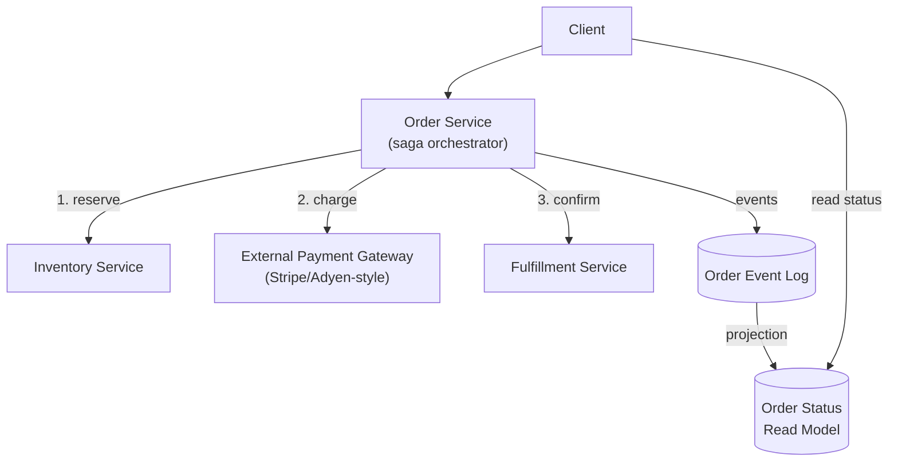

# Design a Payment / Order Processing System

**Primarily tests**: distributed transactions across a boundary you don't control, idempotency
under retries, and CQRS for order status — the one cluster of patterns from the [Prerequisite
Concepts' newest parts](../../system_design_foundation/00_prerequisite_concepts/17_isolation_and_concurrency_control.md)
none of this track's other case studies exercises directly. Extends [Part 01's Saga vs.
2PC](../01_distributed_systems_foundations/tutorial.md#distributed-transactions-2pc-vs-saga)
from an abstract mechanism into a concrete, unavoidable constraint: a payment gateway.

## Clarify

- Is inventory decremented as part of the order (a "reserve then confirm" flow), or is this
  purely a payment-processing service sitting behind an existing inventory system?
- Are refunds/reversals in scope, or just the forward "place order → charge → fulfill" path?
- Synchronous confirmation required (the user waits and sees success/failure immediately), or
  is "processing" an acceptable intermediate state the user can be shown?

## High-Level Design

## Deep-Dive: Why 2PC Is Off the Table the Moment a Third Party Is Involved

The textbook answer to "keep multiple services atomically consistent" is [Part 01's
2PC](../01_distributed_systems_foundations/tutorial.md#distributed-transactions-2pc-vs-saga) —
and it's exactly where a senior answer often stops, without noticing it doesn't actually
apply here. **2PC requires every participant to implement the prepare/commit protocol** —
which means every participant has to be a system you control, or one that's explicitly built
to speak that protocol. A payment gateway is neither: it's an external HTTP API that
authorizes and captures a charge on *its own* schedule, with no concept of "prepare and wait
for my coordinator's go-ahead." **The Saga pattern isn't a stylistic preference here — it's
the only mechanism available**, because it's built for exactly this shape: a sequence of
independent local transactions (reserve inventory, charge the card, confirm fulfillment),
each with its own compensating action if a later step fails (release the inventory
reservation if the charge fails; issue a refund if fulfillment fails after the charge
succeeded).

## Deep-Dive: Idempotency at the Payment Gateway Boundary

Any network call to the payment gateway can fail *after* it actually charged the card but
*before* the order service gets the confirmation back — [Part 2's idempotency
argument](../../system_design_foundation/00_prerequisite_concepts/02_data_and_consistency.md#idempotency)
applies with real money attached. **The fix**: generate a client-side **idempotency key**
per order attempt, and send it with the charge request; the gateway deduplicates on that key
server-side, so retrying the exact same charge request after a lost response is guaranteed
safe rather than a double charge. This has to be paired with the order service's own
persistence: the idempotency key must be written durably *before* the charge call is made,
so that a crash-and-restart mid-flow retries with the *same* key rather than generating a new
one and defeating the entire mechanism.

## Deep-Dive: Preventing an Oversold Item During the Reservation Step

The "reserve inventory" step is where [Part 17's isolation-levels
framework](../../system_design_foundation/00_prerequisite_concepts/17_isolation_and_concurrency_control.md)
becomes directly load-bearing, not theoretical: two concurrent orders for the last unit of
the same item are a textbook **lost update** if the reservation is implemented as a naive
"read quantity, check if positive, write quantity minus one." The two real fixes, [named
precisely in Part
17](../../system_design_foundation/00_prerequisite_concepts/17_isolation_and_concurrency_control.md#the-anomalies-what-isolation-levels-are-actually-named-after):
a single atomic conditional decrement (`UPDATE inventory SET qty = qty - 1 WHERE item_id = ?
AND qty > 0`, relying on the database's own row-level locking rather than an
application-level read-then-write), or optimistic concurrency control with a version check
and retry. For a normal-demand item, either works; for a flash-sale item with extreme
contention on one row, the pessimistic conditional-update version wins for the same reason
[Part 17 named contention as OCC's actual weak
point](../../system_design_foundation/00_prerequisite_concepts/17_isolation_and_concurrency_control.md#optimistic-optimistic-concurrency-control-occ) —
a storm of concurrent OCC retries on one hot row can do *more* wasted work than just letting
requests queue briefly behind a row lock.

## Deep-Dive: CQRS for Order Status

A customer checking "where's my order" needs a fast, simple read — but the order's actual
state lives inside the saga's step-by-step progress, which isn't a shape meant for repeated
querying. This is a direct application of [Part 20's
CQRS](../../system_design_foundation/00_prerequisite_concepts/20_microservices_architecture_patterns.md#cqrs-splitting-the-write-model-from-the-read-model):
the saga's own state transitions *are* the write side, emitted as events (`OrderPlaced`,
`PaymentCharged`, `InventoryReserved`, `OrderShipped`) — literally [Part 20's event sourcing
pattern](../../system_design_foundation/00_prerequisite_concepts/20_microservices_architecture_patterns.md#event-sourcing-the-log-as-the-source-of-truth-applied-to-a-single-entity)
applied to one order — and a separate, denormalized **order status projection** is updated
asynchronously from that event stream, purpose-built for the one query pattern ("show me this
order's current status") that actually matters for reads. The read side lags the write side
by however long the projection takes to update — the same eventual-consistency window [Part
20 already named for
CQRS](../../system_design_foundation/00_prerequisite_concepts/20_microservices_architecture_patterns.md#cqrs-splitting-the-write-model-from-the-read-model),
which is fine for "order status," and would not be fine if this same projection were
mistakenly used to decide whether inventory is still available to reserve.

## Trade-offs

| Decision | Option A | Option B | When to pick which |
|---|---|---|---|
| Saga coordination style | Orchestration (order service explicitly drives each step) | Choreography (each service reacts to the previous one's event) | Orchestration when the compensating-action logic needs central visibility (most payment flows); choreography when steps genuinely belong to independently-owned teams and centralizing them would recreate a monolith |
| Inventory locking | Pessimistic (atomic conditional update) | Optimistic (version check + retry) | Pessimistic under high contention on a single hot item (flash sales); optimistic when most items see low concurrent contention |
| Order status reads | Query the saga's live state directly | CQRS projection, updated async | Projection almost always — direct queries against saga state couple the read path to write-side schema changes and don't scale independently |
| Confirmation UX | Block the user until the full saga completes | Return "processing" immediately, push a status update later | "Processing" unless the business genuinely requires synchronous confirmation (e.g., an in-person point-of-sale terminal) |

## Staff Altitude

A **senior** answer proposes 2PC, or "make it all one transaction," and only reaches for
Saga if pushed on why the payment gateway can't participate in that transaction.

A **staff** answer additionally: (1) identifies immediately that a third-party gateway
structurally rules out 2PC, not as a preference but as a hard constraint, before being asked;
(2) treats the idempotency key's *durability ordering* (write it before the call, not after)
as a first-class design detail, since getting that ordering backwards silently defeats the
entire mechanism it exists to provide; and (3) explicitly separates the *money-movement*
path's correctness requirements (strict, must never double-charge or silently drop a charge)
from the *order-status-read* path's requirements (eventual consistency is fine) instead of
treating "consistency" as one uniform property of the whole system.

## Failure Modes to Raise Proactively

- **The saga coordinator crashes mid-sequence** — the in-progress saga's state must be
  persisted durably at each step (not just held in memory), so that a restart can resume from
  the last completed step rather than losing track of a half-completed order with money
  already charged.
- **The payment gateway's webhook confirming a charge arrives twice** — a very real, common
  case (network retries on the gateway's side), handled by the same idempotency-key dedup
  logic named above, applied to inbound webhook processing, not just outbound charge calls.
- **A compensating action itself fails** (the refund call to the gateway times out after
  inventory was already released) — compensations need their own retry-with-idempotency
  logic; a saga that assumes compensations always succeed on the first try isn't actually
  safe.

## Staff Follow-Ups

- "The business wants to support partial refunds and partial shipments — how does the saga's
  compensating-action model change to support 'undo part of this order' instead of 'undo the
  whole order'?"
- "How would you migrate an existing synchronous, single-database order flow to this saga
  design incrementally, without a risky big-bang cutover?" (a direct pull toward [Part 20's
  strangler fig
  pattern](../../system_design_foundation/00_prerequisite_concepts/20_microservices_architecture_patterns.md#the-strangler-fig-pattern-migrating-without-a-big-bang-rewrite))
- "A fraud-detection step needs to run *after* the charge but *before* fulfillment, and can
  take up to 30 seconds — where does that step go in this saga, and what does the customer
  see while it's running?"

## Practice Variations

- Design a marketplace checkout where a single order splits payment across multiple
  independent sellers, each needing its own compensating action if any one seller's item is
  unavailable.
- Design subscription billing (recurring charges, not one-shot) — how does idempotency change
  when the "same" logical charge legitimately recurs on a schedule?
- Extend this design for a point-of-sale terminal where the confirmation genuinely must be
  synchronous and sub-second, and reconcile that with the async saga model used everywhere
  else.

## Articulate It: Interview Framing & Vocabulary

### Three Ways to Explain This

- **Constraint-first framing (the default for 'how would you keep this consistent'):** "2PC
  isn't a worse option here, it's not an option at all — the payment gateway can't
  participate in a two-phase protocol it was never built to speak. Saga is the direct
  consequence of that constraint, not a stylistic choice."
- **Ordering-matters framing (good for the idempotency deep-dive):** "The idempotency key has
  to be durably written before the charge call goes out, not after — I'd state that ordering
  explicitly, because getting it backwards makes the whole mechanism a no-op on exactly the
  crash scenario it exists to protect against."
- **Split-consistency framing (good for demonstrating judgment, not just mechanism recall):**
  "I wouldn't treat 'consistency' as one property of this whole system — the charge itself
  needs strict correctness, the order-status the customer sees can lag by a few seconds via
  CQRS, and conflating those two is where a lot of over-engineering in payment systems
  actually comes from."

### Vocabulary Builder

- **idempotency key** (n. phrase) — a client-generated identifier sent with a request so a
  server can deduplicate retries; must be persisted before the call it protects is made.
- **compensating action** (n. phrase) — the explicit "undo" step a saga runs for an earlier
  step once a later one fails; a payment refund compensating an earlier successful charge.
- **conditional decrement** (n. phrase) — an atomic `UPDATE ... WHERE qty > 0`-style write
  that relies on the database's own row lock instead of an application-level read-then-write,
  the direct fix for a lost-update race on inventory.
- **"…structurally rules it out, not just makes it harder"** — a fluent way to distinguish a
  hard constraint (2PC across a third party) from a mere trade-off, useful whenever an
  interviewer probes why an obvious-sounding option was dismissed.

---

**Previous:** [11. URL Shortener](../11_design_url_shortener/tutorial.md)  |  **Next:** [13. Distributed File Storage](../13_design_distributed_file_storage/tutorial.md)
