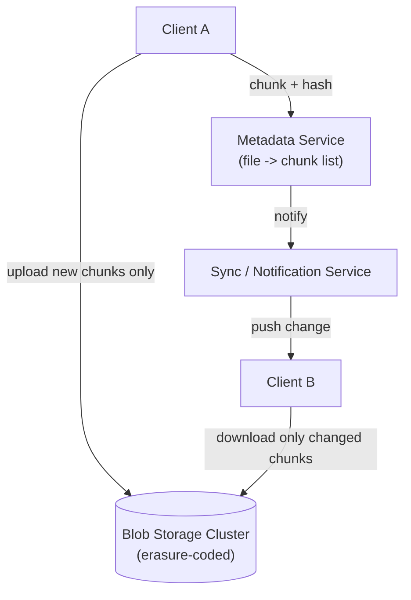

# Design a Distributed File Storage System (Dropbox / Google Drive)

**Primarily tests**: separating metadata from blob storage, content-addressed chunking and
dedup, and the replication-vs-erasure-coding trade-off at real scale — a concrete,
product-shaped application of [Part 2's GFS reference
architecture](../../system_design_foundation/00_prerequisite_concepts/02_data_and_consistency.md#gfs-2003-the-reference-architecture)
and [erasure coding
section](../../system_design_foundation/00_prerequisite_concepts/02_data_and_consistency.md#erasure-coding-durability-without-3x-storage),
neither of which this track's other case studies exercise directly.

## Clarify

- What's the typical file size range — mostly small documents, or large media files (video,
  disk images)? This single answer drives the chunking strategy.
- Is real-time collaborative editing in scope, or is this pure file sync/backup (edits happen
  offline, then sync)? Assume pure sync — [a separate case
  study](../14_design_collaborative_doc_editor/tutorial.md) covers real-time co-editing.
- Is cross-device sync latency measured in seconds or is "eventually, within a minute" fine?

## High-Level Design

## Deep-Dive: Chunking and Content-Addressed Dedup

Splitting a file into fixed- or variable-size **chunks**, each identified by a hash of its own
contents (**content-addressed storage**), buys two things at once: **delta sync** (a small
edit to a large file only needs to re-upload the chunks that actually changed, not the whole
file) and **cross-user dedup** (two different users uploading the identical file, or the
identical shared attachment, produce identical chunk hashes — the blob store only needs to
keep one physical copy, referenced by both users' metadata). The chunk-size choice is a real
trade-off, not a default to leave unexamined: smaller chunks catch more duplicate content and
shrink delta-sync uploads, at the cost of a larger per-file chunk-list in the metadata
service and more chunk-lookup overhead per file.

## Deep-Dive: Replication vs. Erasure Coding for the Blob Tier

Once a chunk is written, it's immutable (content-addressed data never changes — a different
version is a different hash), which makes it a clean fit for [Part 2's erasure-coding
trade-off](../../system_design_foundation/00_prerequisite_concepts/02_data_and_consistency.md#erasure-coding-durability-without-3x-storage):
**3x replication** is simple and fast to read (any replica serves the request directly), at
3x the raw storage cost; **erasure coding** achieves comparable durability at roughly 1.4-1.5x
storage overhead instead of 3x, at the cost of needing to reconstruct a chunk from surviving
fragments on a read that hits a missing piece — real compute, not free. For a storage
product where most data is cold (uploaded once, rarely re-read) rather than hot, erasure
coding's storage savings usually win outright; a small, frequently-accessed "hot" tier can
still use straight replication for the fast-read benefit, mirroring [Part 11's own
polyglot-persistence
argument](../../system_design_foundation/00_prerequisite_concepts/11_taxonomy_of_storage_choice.md#the-golden-hammer-fallacy-and-its-antidote-polyglot-persistence) —
one durability strategy isn't automatically right for the whole system.

## Deep-Dive: Conflict Resolution Without Real-Time Coordination

Because this is offline-first sync, not real-time collaboration, two devices can legitimately
edit the same file while disconnected from each other — there's no live channel to negotiate
a merge the way [the collaborative-editor case
study](../14_design_collaborative_doc_editor/tutorial.md) does. The pragmatic,
widely-used real answer (Dropbox's actual approach) isn't automatic content merging — it's
**"last write wins for the canonical copy, and keep the loser as a conflicted copy"**: when
sync detects two divergent versions of the same file with no common resolution path, it keeps
both, renames the non-winning one (`document (conflicted copy from Alice's laptop).docx`),
and leaves reconciliation to the human, rather than attempting a content-level merge the
system can't safely reason about for an opaque binary file. This is a deliberate,
principal-level restraint: attempting automatic merging on content you can't structurally
understand is a correctness risk, not a convenience.

## Deep-Dive: Scaling the Metadata Service Independently From the Blobs

The metadata service (which files exist, which chunks each one maps to, sharing/permissions)
has a completely different access pattern from the blob tier: small, frequent, latency-
sensitive reads and writes, versus large, infrequent, throughput-oriented blob transfers —
exactly [Part 11's access-pattern
axis](../../system_design_foundation/00_prerequisite_concepts/11_taxonomy_of_storage_choice.md#1-access-pattern-how-is-the-data-actually-queried)
arguing for two structurally different stores rather than one. Metadata shards naturally by
user or by folder ([Part 12's shard-key
framework](../../system_design_foundation/00_prerequisite_concepts/12_sharding_and_the_vertical_wall.md#horizontal-scaling-for-data-shards-and-the-router)
applies directly), while the blob tier scales as an undifferentiated pool of content-addressed
storage with no per-user partitioning need at all — a chunk doesn't belong to a user, a
metadata pointer does.

## Trade-offs

| Decision | Option A | Option B | When to pick which |
|---|---|---|---|
| Chunk size | Small (more dedup, smaller deltas) | Large (less metadata overhead) | Small for document-heavy, frequently-edited workloads; large for mostly-write-once media files |
| Blob durability | 3x replication (fast reads, 3x cost) | Erasure coding (~1.4x cost, reconstruction cost on missing-fragment reads) | Erasure coding for the cold majority; replication for a small hot working set |
| Conflict handling | Automatic content merge | Conflicted-copy fallback | Conflicted-copy for opaque/binary files (the pragmatic default); automatic merge only for structured, mergeable formats like plain text (CRDT territory, not this design) |

## Staff Altitude

A **senior** answer designs "a database of files with S3 behind it" and stops there.

A **staff** answer additionally: (1) separates metadata and blob storage as two systems with
genuinely different scaling and consistency needs, rather than one schema doing both jobs;
(2) treats chunk size and replication-vs-erasure-coding as named, quantified trade-offs
against the actual workload's cold/hot ratio, not defaults; and (3) explicitly rejects
automatic merging for opaque file types as a correctness risk, rather than presenting
"just merge the conflict" as if it were free.

## Failure Modes to Raise Proactively

- **A chunk upload partially completes** (client disconnects mid-upload) — the metadata
  entry pointing at that file version must not be marked complete until every referenced
  chunk hash is confirmed durably stored, or a later download will fail on a missing chunk.
- **Orphaned chunks accumulate** as files are deleted or overwritten — a **garbage collection**
  pass is needed to reclaim chunks no longer referenced by any live metadata entry, the exact
  same reference-counting problem any content-addressed store faces.
- **A popular shared file (a public download link) creates a hot-key read pattern** on one
  chunk set — [Part 15's cache-stampede
  mitigations](../../system_design_foundation/00_prerequisite_concepts/15_caching.md#cache-stampede-thundering-herd)
  apply directly in front of the blob tier for this case.

## Staff Follow-Ups

- "Design file versioning/history on top of this — how does storing every past version
  interact with the chunk-dedup mechanism you already have?"
- "A folder is shared with 50,000 people inside one organization — how does that change your
  metadata service's design, if at all?"
- "Walk through exactly how garbage collection safely reclaims an orphaned chunk without
  racing a concurrent upload that's about to reference that same chunk hash again."

## Practice Variations

- Design a photo-backup product specifically (near-duplicate detection on top of exact-hash
  dedup, since photos are rarely byte-identical but are often near-identical).
- Design the sharing/permissions layer specifically (nested folder permission inheritance,
  revocation propagation).
- Extend this design to support client-side end-to-end encryption, and reason about what that
  does to server-side dedup (a real, hard trade-off: encrypted chunks from two different
  users are never identical, even for the same underlying content).

## Articulate It: Interview Framing & Vocabulary

### Three Ways to Explain This

- **Two-systems framing (the default for 'how would you design the storage layer'):** "I'd
  split this into two systems on purpose — a metadata service for small, frequent,
  latency-sensitive lookups, and a blob tier for large, infrequent, throughput-oriented
  transfers — rather than one schema trying to serve both access patterns."
- **Restraint framing (good for the conflict-resolution discussion):** "For opaque file
  types, I'd deliberately avoid automatic content merging — keeping both versions as a
  conflicted copy and letting the human resolve it is the safer, more honest answer than
  pretending the system can merge content it can't structurally understand."
- **Cost-quantified framing (good for the durability trade-off):** "I wouldn't default to 3x
  replication or erasure coding — I'd size the decision against the actual hot/cold ratio of
  this workload, since erasure coding's ~1.4x overhead versus 3x is a real, quantifiable
  storage-cost difference at this scale."

### Vocabulary Builder

- **content-addressed storage** (n. phrase) — identifying a chunk by a hash of its own
  contents, which is what makes cross-user dedup and immutability-based durability
  strategies (like erasure coding) possible.
- **delta sync** (n. phrase) — re-uploading only the chunks that changed within a file,
  instead of the whole file, made possible by content-addressed chunking.
- **conflicted copy** (n. phrase) — the pragmatic fallback for an unresolvable concurrent
  edit on an opaque file: keep both versions, rename the non-winning one, defer to the human.
- **"…a chunk doesn't belong to a user, a metadata pointer does"** — a precise, reusable line
  for explaining why the blob tier scales independently of any per-user sharding scheme.

---

**Previous:** [12. Payment / Order Processing](../12_design_payment_order_processing/tutorial.md)  |  **Next:** [14. Collaborative Doc Editor](../14_design_collaborative_doc_editor/tutorial.md)
