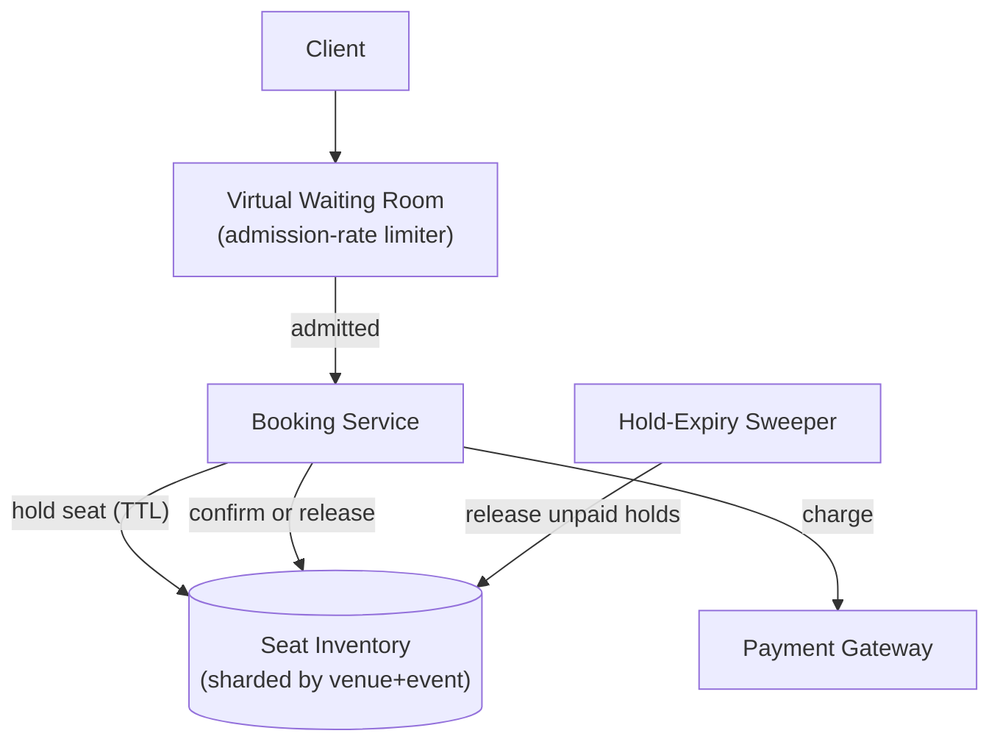

# Design a Ticket / Event Booking System (Ticketmaster)

**Primarily tests**: preventing an oversold seat under extreme concurrent contention — the
case study that puts [Part 17's isolation levels and concurrency
control](../../system_design_foundation/00_prerequisite_concepts/17_isolation_and_concurrency_control.md)
to direct, concrete use, plus the "protect the system from its own demand spike" problem a
massive on-sale creates.

## Clarify

- General admission (just a count of remaining tickets) or specific numbered seats (a seat
  map)? Assume specific seats — the harder, more common real version.
- How long does a user get to hold a seat before completing payment (the **reservation hold**
  window)?
- Is this a routine on-sale, or does the design need to survive a single event selling out in
  under a minute (a "Taylor Swift" on-sale)? Assume the latter — that's the version that
  actually stresses the design.

## High-Level Design

## Deep-Dive: Preventing an Oversold Seat, the Direct Application of Part 17

This is the concrete scenario [Part 17's isolation-levels
framework](../../system_design_foundation/00_prerequisite_concepts/17_isolation_and_concurrency_control.md)
exists to prepare you for: two users clicking the same seat within milliseconds of each other
is a **lost update** if the reservation is a naive read-check-write. The fix is the same one
[Part 17
named](../../system_design_foundation/00_prerequisite_concepts/17_isolation_and_concurrency_control.md#pessimistic-two-phase-locking-2pl):
an atomic conditional update (`UPDATE seats SET status = 'held', held_by = ?, held_until = ?
WHERE seat_id = ? AND status = 'available'`), relying on the database's own row lock rather
than an application-level check. **The genuinely interesting staff-level nuance here**:
[Part 17 named optimistic concurrency control as winning under *low* contention and losing
under
*high*](../../system_design_foundation/00_prerequisite_concepts/17_isolation_and_concurrency_control.md#optimistic-optimistic-concurrency-control-occ) —
and a hot on-sale is the single most contended scenario this whole doc series describes:
thousands of concurrent requests racing for the same handful of front-row seats. That's
precisely the case where OCC's retry storm becomes actively harmful, and straightforward
pessimistic locking on the seat row — even though it means some requests briefly queue behind
others — produces less wasted work overall. This is the opposite of the *typical* system-
design instinct to reach for optimistic concurrency "because locking doesn't scale"; the
right call here inverts that default because the contention profile inverts it.

## Deep-Dive: The Reservation Hold as a TTL-Backed Soft Lock

A seat isn't sold the instant it's clicked — it's **held** for a short window (typically
5-10 minutes) while the user completes payment, then either confirmed or released. This is
the same **TTL-based expiry** mechanism [Part 15's cache eviction
policies](../../system_design_foundation/00_prerequisite_concepts/15_caching.md#eviction-policies-what-gets-removed-when-the-cache-is-full)
already named, applied to inventory state instead of a cache entry: the hold expires
automatically if payment isn't completed in time, releasing the seat back to availability
without requiring an explicit user action. A background **sweeper** process (or a delayed-
message mechanism on a queue, per [Part 18's delivery
model](../../system_design_foundation/00_prerequisite_concepts/18_message_queues_and_event_driven_semantics.md#the-problem-precisely))
handles the actual expiry, rather than relying on the booking service to remember to check
every hold on every request.

## Deep-Dive: The Virtual Waiting Room as Load Shedding, Not a Gimmick

A massive on-sale generates far more simultaneous demand than the seat-inventory service can
safely handle even with correct locking — the underlying problem isn't correctness, it's
raw concurrency volume overwhelming the system before locking logic even gets a chance to
run. The **virtual waiting room** is [Part 18's backpressure/load-shedding
instinct](../../system_design_foundation/00_prerequisite_concepts/18_message_queues_and_event_driven_semantics.md#backpressure-what-happens-when-the-consumer-cant-keep-up) —
admit users into the actual booking flow at a controlled rate, holding everyone else in a
queue with an honest position/wait estimate, rather than letting every user hit the seat-
inventory service simultaneously and having most of them fail anyway. Functionally, it's
[Part 3's rate limiting](../../system_design_foundation/00_prerequisite_concepts/03_communication_and_resilience.md#rate-limiting)
applied to *admission into the flow* rather than to individual API calls — the same
mechanism, aimed one layer earlier, specifically to protect the contended resource (the seat
map) from ever seeing more concurrent traffic than it can correctly process.

## Deep-Dive: Sharding the Seat Map to Contain the Hot Spot

[Part 12's shard-key
framework](../../system_design_foundation/00_prerequisite_concepts/12_sharding_and_the_vertical_wall.md#horizontal-scaling-for-data-shards-and-the-router)
applies directly here: shard seat inventory by **(venue, event)**, not by seat ID alone or
globally. This ensures a massive on-sale for one event creates contention *only* within that
event's own shard — every other concurrently on-sale event elsewhere in the system is
completely unaffected, containing the hot spot to exactly the scope that's actually
contended instead of letting one event's demand spike degrade the entire platform.

## Trade-offs

| Decision | Option A | Option B | When to pick which |
|---|---|---|---|
| Seat locking | Pessimistic (conditional update, row lock) | Optimistic (version + retry) | Pessimistic for high-contention hot events; optimistic is rarely the right default here, unlike most other contexts in this series |
| Waiting room | None — let all traffic hit booking directly | Admission-rate-limited queue | Queue whenever expected concurrent demand meaningfully exceeds what the seat-inventory tier can correctly serve |
| Hold expiry | Client-driven ("give up the seat" button) | Server-side TTL sweep, independent of client behavior | Always server-side — never trust a client to reliably signal it gave up |

## Staff Altitude

A **senior** answer proposes a locking mechanism for seat reservation and stops there.

A **staff** answer additionally: (1) recognizes that this specific contention profile
inverts the usual optimistic-concurrency default, and states *why* rather than reaching for
OCC out of habit; (2) proposes the virtual waiting room proactively as a load-shedding
mechanism protecting the seat-inventory tier, rather than treating "the system fell over
during the on-sale" as an unrelated capacity problem to solve separately; and (3) shards
by (venue, event) specifically to contain a hot event's contention to itself, rather than
leaving the blast radius of one popular on-sale undefined.

## Failure Modes to Raise Proactively

- **A hold expires the instant a payment confirmation arrives** — a genuine race between the
  sweeper releasing the seat and the payment succeeding; the confirmation path needs to check
  hold ownership atomically before finalizing, and handle the case where it's already too
  late gracefully (refund immediately, don't silently keep the charge for a seat that's gone).
- **Double-booking across regions** if seat-inventory replicas aren't strongly consistent
  during a network partition — this needs the same CAP-theorem-aware reasoning [Part
  13](../../system_design_foundation/00_prerequisite_concepts/13_cap_theorem_and_pacelc.md)
  already established: for seat inventory specifically, correctness (no double-sell) usually
  outweighs availability, unlike many other parts of this system.
- **The waiting room itself becomes a bottleneck** if its own admission-tracking state isn't
  designed to handle the same order-of-magnitude concurrency as the event it's protecting
  against.

## Staff Follow-Ups

- "The event turns out to be oversold anyway, due to a bug that shipped last week — walk
  through how you detect it and what you do for the affected customers after the fact."
- "Support booking a group of 4 seats together atomically — no customer should end up with 2
  of 4 seats because the other 2 sold out mid-transaction."
- "How would you detect and rate-limit bot-driven bulk purchasing without punishing real
  users stuck behind a slow connection in the waiting room?"

## Practice Variations

- Design airline seat selection specifically (seats persist across a much longer browsing
  session than a concert on-sale, changing the hold-TTL trade-off).
- Design a restaurant reservation system (lower contention, but adds a no-show/overbooking
  policy dimension this design doesn't need).
- Extend this design to support dynamic pricing that changes based on real-time demand during
  the on-sale itself.

## Articulate It: Interview Framing & Vocabulary

### Three Ways to Explain This

- **Contention-inverts-the-default framing (the default for 'how do you prevent double-
  booking'):** "I'd use pessimistic locking here specifically, even though optimistic
  concurrency is often the better general default — a hot on-sale is the single most
  contended scenario this kind of system sees, and that's exactly the case where OCC's retry
  storm does more harm than a brief row-level lock."
- **Load-shedding framing (good for 'how does this survive a massive on-sale'):** "I'd add a
  virtual waiting room proactively, not as a reaction to an outage — it's rate limiting
  applied to admission into the flow, protecting the contended seat-inventory tier from ever
  seeing more concurrent traffic than it can correctly serve."
- **Blast-radius framing (good for demonstrating scale reasoning):** "I'd shard seat
  inventory by venue and event specifically, so one massively popular on-sale's contention
  stays contained to its own shard instead of degrading every other concurrently on-sale
  event on the platform."

### Vocabulary Builder

- **conditional update** (n. phrase) — an atomic `UPDATE ... WHERE status = 'available'`
  write relying on the database's row lock, the direct fix for a lost-update race on a
  contended seat.
- **reservation hold** (n. phrase) — a TTL-backed soft lock on inventory, held during payment
  and released automatically on expiry via a server-side sweep, never trusting the client.
- **virtual waiting room** (n. phrase) — admission-rate-limiting users into a booking flow
  itself, load-shedding to protect a contended downstream resource from a demand spike.
- **"…inverts the usual default"** — a fluent way to signal you understand *why* a general
  rule (optimistic concurrency usually wins) doesn't apply here, rather than applying it by
  habit.

---

**Previous:** [14. Collaborative Doc Editor](../14_design_collaborative_doc_editor/tutorial.md)  |  **Next:** [16. Notification System](../16_design_notification_system/tutorial.md)
