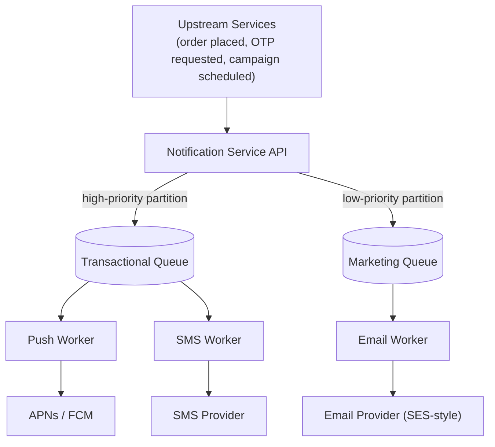

# Design a Notification System (Push / Email / SMS at Scale)

**Primarily tests**: multi-channel fan-out with priority isolation, delivery-guarantee
semantics under retries, and provider failover — a concrete, product-shaped exercise of [Part
18's message-queue
semantics](../../system_design_foundation/00_prerequisite_concepts/18_message_queues_and_event_driven_semantics.md)
and [Part 3's resilience
vocabulary](../../system_design_foundation/00_prerequisite_concepts/03_communication_and_resilience.md#resilience-vocabulary),
applied together.

## Clarify

- Which channels are in scope — push, email, SMS, in-app? Each has its own provider,
  throughput limit, and cost profile.
- Are any notifications **transactional** (an OTP code, a password-reset link — must-deliver,
  latency-sensitive) as opposed to **best-effort** (a marketing campaign, a weekly digest)?
  Assume both exist — the interaction between them is the actual hard part.
- Does the product need user-level preference/opt-out management in scope, or is that an
  existing separate service this system just reads from?

## High-Level Design

## Deep-Dive: Priority Isolation — Why One Queue Is the Wrong Answer

A single shared queue for every notification type means a 100-million-recipient marketing
campaign can sit in front of a time-sensitive OTP code simply because it was enqueued first
— an unacceptable outcome for a transactional message the user is actively waiting on. The
fix is [Part 3's **bulkhead**
pattern](../../system_design_foundation/00_prerequisite_concepts/03_communication_and_resilience.md#resilience-vocabulary),
applied here as **separate queues (or separate Kafka partitions) per priority tier**, each
with its own dedicated worker pool: a flood of marketing sends exhausting the marketing
queue's workers has no ability to starve the transactional tier's separately-provisioned
capacity. This is the same isolation instinct as a bulkhead protecting one dependency's
resource pool from another's failure — here applied to *priority*, not to a downstream
service.

## Deep-Dive: Idempotency and Delivery Guarantees Under Retry

A notification worker crashing mid-send, or a provider's confirmation response getting lost,
creates exactly [Part 18's at-least-once delivery
scenario](../../system_design_foundation/00_prerequisite_concepts/18_message_queues_and_event_driven_semantics.md#delivery-guarantees-what-sent-actually-promises):
the safe default is to retry, which means the *same* notification can legitimately be sent
twice unless the send path is made idempotent. The practical mechanism — [the same one Part 2
already
named](../../system_design_foundation/00_prerequisite_concepts/02_data_and_consistency.md#idempotency):
a unique notification ID generated once at creation, checked against a dedup store
(recently-sent IDs, with a TTL matching the maximum plausible retry window) before a worker
actually calls the provider. Without this, a transient provider timeout that actually
succeeded server-side turns into a user receiving the same push notification three times.

## Deep-Dive: Provider Abstraction and Failover

Every real-world push/SMS provider has (a) an outage now and then and (b) its own throughput
ceiling that's easy to exceed if a burst of notifications all target it at once. The
practical answer to both: abstract each channel behind a common internal interface with
multiple concrete provider implementations, and wrap each provider call in [Part 3's circuit
breaker
pattern](../../system_design_foundation/00_prerequisite_concepts/03_communication_and_resilience.md#resilience-vocabulary) —
once a provider's failure rate crosses a threshold, stop sending to it and fail over to a
backup provider (or queue for retry once it recovers) rather than continuing to hammer a
struggling dependency. This is the same "fail fast instead of piling on" reasoning [Part 3
already established](../../system_design_foundation/00_prerequisite_concepts/03_communication_and_resilience.md#resilience-vocabulary),
applied to an external notification provider instead of an internal microservice dependency.

## Deep-Dive: Batching and Digests as a Load *and* UX Decision Together

Sending every individual event as its own immediate notification doesn't just risk
overwhelming the provider layer at scale — it degrades the actual user experience (nobody
wants twelve separate pushes for twelve individually-liked photos in one minute). Batching
low-priority notifications into a periodic **digest** trades immediacy for reduced volume and
reduced user annoyance simultaneously — worth naming explicitly as a case where a systems-
load decision and a product decision point the same direction, rather than treating batching
as purely a scaling technique with a UX side effect.

## Trade-offs

| Decision | Option A | Option B | When to pick which |
|---|---|---|---|
| Queue structure | One shared queue, all priorities | Separate queues/partitions per priority tier | Always separate once both transactional and best-effort traffic coexist — the isolation is cheap and the failure mode without it is severe |
| Delivery semantics | At-most-once (simple, can silently drop) | At-least-once + idempotent dedup | At-least-once + dedup for anything user-facing; at-most-once only for genuinely disposable, high-volume telemetry-style pings |
| Real-time vs. digest | Send immediately, always | Batch into a periodic digest for low-priority events | Digest for anything not time-sensitive; always immediate for transactional/security notifications |

## Staff Altitude

A **senior** answer designs one notification pipeline that fans out to multiple channels and
stops there.

A **staff** answer additionally: (1) proactively separates transactional from best-effort
traffic with dedicated capacity per tier, rather than waiting for a marketing-campaign-caused
OTP delay incident to justify it after the fact; (2) treats idempotent delivery as a
first-class requirement from the start, not a patch applied after the first duplicate-send
complaint; and (3) frames batching/digesting as a joint systems-and-product decision,
signaling awareness that infrastructure choices here have direct user-experience
consequences, not just cost consequences.

## Failure Modes to Raise Proactively

- **A notification storm from a buggy upstream service** (a retry loop in another team's
  code repeatedly re-triggering the same event) — needs a per-user, per-event-type rate limit
  at the notification service's own ingress, independent of whatever caused the storm
  upstream.
- **A provider outage causes unbounded queue growth** — [Part 18's backpressure
  responses](../../system_design_foundation/00_prerequisite_concepts/18_message_queues_and_event_driven_semantics.md#backpressure-what-happens-when-the-consumer-cant-keep-up)
  apply directly: buffer up to a bounded retention limit, and beyond that, shed the lowest-
  priority tier first rather than letting the queue grow until storage is exhausted.
- **Stale device tokens** accumulate as users uninstall apps or replace devices, wasting sends
  and skewing delivery-rate metrics — needs a token-invalidation feedback loop from the
  provider's own bounce/failure responses, not just a one-time registration.

## Staff Follow-Ups

- "Design the user-preference/opt-out service this system reads from — how does an opt-out
  change propagate to an in-flight, already-queued notification?"
- "A single marketing campaign needs to reach 100 million users without starving
  transactional traffic at any point during the send — walk through the actual throughput
  math and queue sizing."
- "Add read-receipt tracking (did the user actually see this notification) — what does that
  add to the architecture, and does it belong in this system or a separate analytics
  pipeline?"

## Practice Variations

- Design the push-token lifecycle management service specifically (registration, rotation,
  invalidation on bounce).
- Design an in-app notification center (persistent, queryable history) as a variant that adds
  a durable read model on top of this ephemeral delivery pipeline.
- Extend this design for a "critical alert" tier that must bypass a user's do-not-disturb
  settings (an incident-paging system is the same shape, at much lower volume and much
  higher per-message importance).

## Articulate It: Interview Framing & Vocabulary

### Three Ways to Explain This

- **Isolation-first framing (the default for 'design a notification system'):** "I'd
  separate transactional and best-effort traffic into isolated queues with dedicated worker
  capacity from the start — the same bulkhead reasoning that stops one failing dependency
  from starving requests to a healthy one, applied here to priority instead of a downstream
  service."
- **Idempotency framing (good for a 'what if the send fails' follow-up):** "At-least-once
  delivery is the only safe default under retries, which means every send needs a dedup key
  — I'd want to know that's in place before calling this design done, since a duplicate push
  notification is a visible, annoying user-facing bug."
- **Joint-decision framing (good for demonstrating product judgment, not just infra):**
  "Batching low-priority notifications into a digest isn't purely a load-reduction technique
  — it's also directly better for the user, and I'd frame that as one decision serving both
  goals rather than two separate justifications."

### Vocabulary Builder

- **priority isolation** (n. phrase) — separate queues/worker pools per notification tier so
  high-volume, low-priority traffic can never starve time-sensitive, high-priority traffic.
- **digest** (n.) — batching multiple low-priority notifications into one periodic delivery,
  trading immediacy for reduced volume and reduced user annoyance simultaneously.
- **provider failover** (n. phrase) — a circuit-breaker-guarded switch to a backup provider
  once the primary's failure rate crosses a threshold, rather than continuing to retry a
  struggling one.
- **"…a systems decision and a product decision pointing the same direction"** — a fluent way
  to frame batching/digesting as serving both scaling and UX goals at once, rather than
  justifying it on cost alone.

---

**Previous:** [15. Ticket / Event Booking](../15_design_ticket_booking_system/tutorial.md)  |  **Next:** [17. Ad Click Aggregation](../17_design_ad_click_aggregation/tutorial.md)
